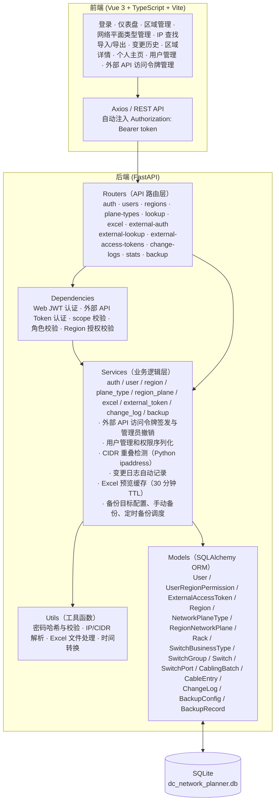
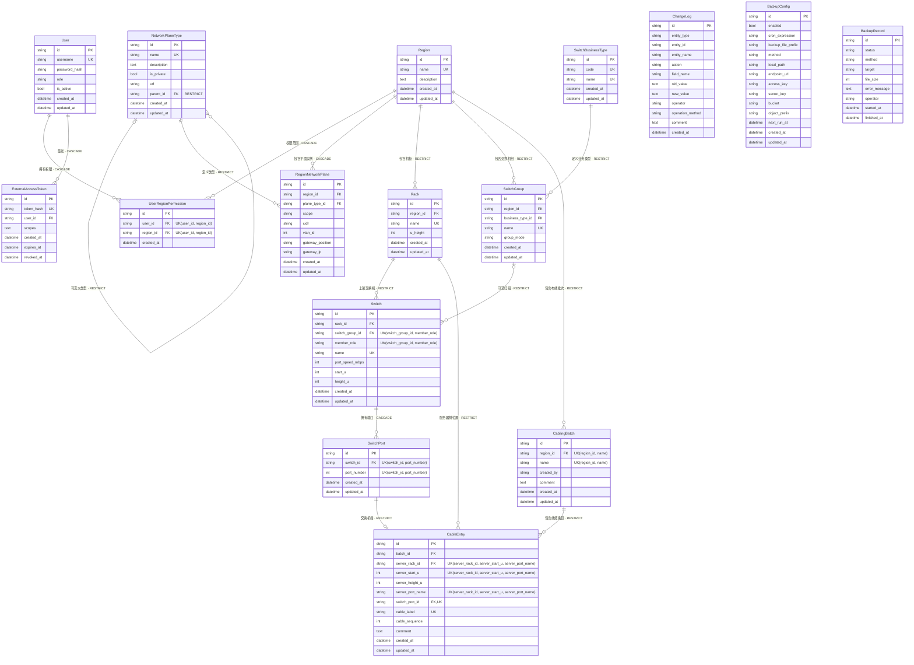
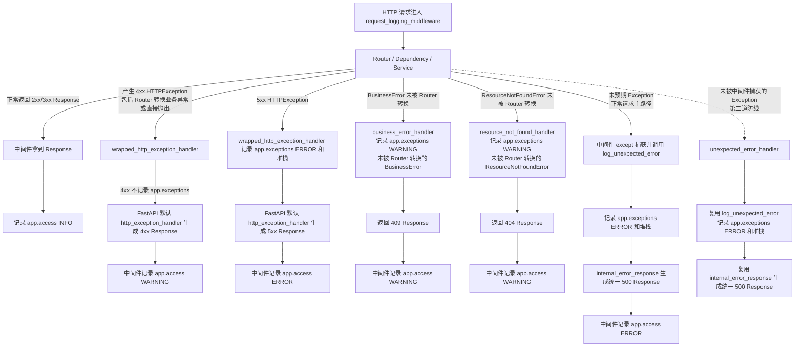
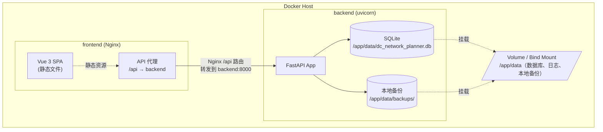
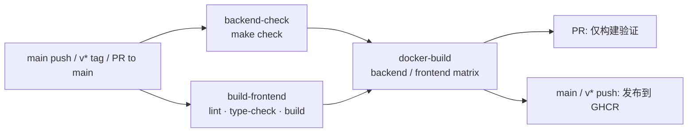

# DC Network Planner - 架构设计文档

## 1. 核心需求

| 需求 | 说明 |
|---|---|
| Region 管理 | 查询、创建、更新、删除数据中心 Region |
| 网络平面自定义 | 可自定义网络平面类型（如管理平面、业务平面、存储平面等），每个 Region 可独立创建/删除对应的网络平面实例 |
| 网络平面地址管理 | 管理每个 Region 下各网络平面的 CIDR、VLAN ID、网关位置和网关 IP |
| IP 查重 | 给定 IP 地址或 CIDR 地址段，快速检查是否已被分配，返回所属 Region 和网络平面 |
| Excel 导入 | 按模板格式上传 Excel，支持预览验证后批量导入 |
| Excel 导出 | 按 Region 过滤导出为 Excel |
| 变更追溯 | 所有数据操作（创建/更新/删除/导入）自动记录变更日志，可查询操作者、时间、变更内容 |
| 数据备份 | 支持配置备份目标，手动立即备份，按五段式 cron 表达式自动备份 |
| 认证与权限 | 支持本地账号登录，按 administrator / user 两类角色控制全局配置和 Region 业务数据写权限 |
| 外部 API 访问令牌 | 支持短期不透明 Token 签发；同一用户重新签发时自动替换旧令牌，管理员可查看未撤销、未过期令牌并手动撤销 |

## 2. 技术选型

| 层级 | 技术 | 版本 | 选型理由 |
|---|---|---|---|
| 后端框架 | Python FastAPI | 0.115+ | 高性能异步框架，自动生成 OpenAPI 文档，Pydantic 校验 |
| ORM | SQLAlchemy | 2.0+ | 成熟可靠，支持迁移工具 Alembic |
| 数据库 | SQLite | 3.x | 零配置，单文件存储，适合 MVP 阶段 |
| 数据库迁移 | Alembic | 1.14+ | SQLAlchemy 官方迁移工具 |
| Excel 处理 | openpyxl | 3.1+ | 纯 Python Excel 读写，无系统依赖 |
| 对象存储 | boto3 | 1.34+ | 支持 S3 兼容对象存储备份 |
| 时区处理 | zoneinfo | Python 内置 | 使用 IANA 时区名解释业务时间 |
| IP 处理 | ipaddress | Python 内置 | 标准库，CIDR 解析与重叠检测 |
| 前端框架 | Vue 3 | 3.5+ | Composition API，体积小，生态丰富 |
| 前端语言 | TypeScript | 6.0+ | 为 API 响应、表单和页面状态提供静态类型约束 |
| 前端构建 | Vite | 5.4+ | 极速 HMR，开箱即用 |
| 前端质量检查 | ESLint | 9.x | Vue/TypeScript 代码质量检查 |
| UI 组件库 | Element Plus | 2.8+ | 中文友好，表格/表单/对话框组件丰富 |
| 状态管理 | Pinia | 2.2+ | Vue 3 官方推荐状态管理 |
| HTTP 客户端 | Axios | 1.7+ | 拦截器、请求/响应转换 |
| 前后端通信 | RESTful API | - | 简单通用，便于调试 |

## 3. 整体架构



### 3.1 后端分层架构

后端采用经典的三层架构：

1. **Router 层** - API 端点定义，请求参数解析，HTTP 状态码转换和响应序列化。依赖 `get_db` 获取数据库会话；Web 业务接口依赖 `get_current_user` / `require_administrator` / `ensure_region_business_write_allowed` 完成认证与授权，外部 OpenAPI 依赖 `get_external_api_actor` / `require_external_scope` 完成不透明访问令牌认证与 scope 授权；不直接访问 SQLAlchemy Model。
2. **Service 层** - 核心业务逻辑和数据访问，包括 CIDR 重叠检测、变更日志记录、Excel 导入业务校验、列表聚合统计和响应所需业务上下文。Router 层调用 Service 层，Service 层操作 Model 层；同一请求链路中已获取并校验过的实体或上下文应继续复用，避免重复查询同一业务对象。Excel 工具函数只负责工作簿读写、表头匹配和单元格基础清理，空作用域默认 Global、VLAN 合法性等业务解释在 Service 层完成。
3. **Model 层** - SQLAlchemy ORM 模型，定义数据表结构和关系。通过 Alembic 管理数据库迁移。

### 3.2 前端组件架构

前端采用 Vue 3 Composition API + TypeScript + Vue Router 组织页面：

- **App.vue** - 根组件，通过 `<router-view />` 渲染当前路由页面，并提供页面切换动画
- **AppLayout.vue** - 布局组件，包含侧边栏导航 + 顶栏（面包屑 + 当前用户入口 + 退出登录）+ 内容区
- **views/** - 页面组件，每个对应一个路由
- **api/** - Axios 请求封装模块，主要按业务领域拆分；`excel.ts` 当前同时承载 Excel、统计和变更日志接口，另包含外部 API 访问令牌的管理员管理接口调用，请求参数和响应数据使用 TypeScript 类型约束
- **stores/** - Pinia 状态管理，存储登录 token、当前用户、Region 授权和侧边栏状态
- **router/** - 路由配置，懒加载页面组件，并通过全局守卫保护登录态与管理员页面
- **types/** - 前端业务类型定义，覆盖 Region、网络平面、用户、外部 API 访问令牌、备份、导入导出和统计响应

### 3.3 项目结构

项目结构只记录稳定的分层职责，不逐一复制容易随功能变化的文件清单。具体文件以仓库当前目录为准。

```text
backend/
├── app/
│   ├── main.py                    # 应用创建、中间件、异常处理和 Router 注册
│   ├── config.py                  # 配置加载
│   ├── database.py                # 数据库引擎和会话
│   ├── dependencies.py            # 数据库、认证、角色、scope 和 Region 权限依赖
│   ├── routers/                   # HTTP 边界与依赖注入
│   ├── services/                  # 业务规则、事务内数据访问和审计调用
│   ├── schemas/                   # Pydantic 请求与响应契约
│   ├── models/                    # SQLAlchemy ORM 模型
│   ├── utils/                     # IP、Excel、密码、时间等通用工具
│   └── static/api_docs/           # 离线 OpenAPI 文档资源
├── alembic/                       # 数据库迁移
├── scripts/                       # seed、数据库恢复等非 HTTP 入口
└── tests/                         # 独立内存 SQLite 的后端测试
```

```text
frontend/
├── src/
│   ├── api/                       # Axios 请求封装，按业务领域拆分
│   ├── views/                     # 路由页面组件，各页面自行获取业务数据
│   ├── types/                     # 跨组件、跨层业务类型
│   ├── components/                # 可复用组件和应用布局
│   ├── stores/                    # 会话与少量全局 UI 状态
│   ├── router/                    # Vue Router 路由与守卫
│   └── utils/                     # 展示与树结构辅助函数
├── public/                        # 静态资源
└── nginx.conf                     # 容器内静态文件服务和 API 反向代理
```

HTTP 请求遵循 `routers/ -> services/ -> models/`；Schema 只定义 API 数据形状，Service 承担业务校验和数据访问。非 HTTP 入口必须自行管理事务边界。

### 3.4 单实例部署约束

当前系统按单个后端服务实例部署设计，不支持多个后端进程或多个后端容器同时接入同一个数据库并通过负载均衡对外服务。

该约束来自当前 MVP 阶段的简化取舍：

1. 数据库使用本地 SQLite 文件，适合单服务进程直接访问
2. Excel 导入预览使用后端进程内 `TTLCache` 保存，`preview_id` 只能由生成它的实例确认导入
3. 定时备份调度运行在后端进程内，多实例同时运行会产生重复调度风险

本地开发默认使用 `DATABASE_URL=sqlite:///./dc_network_planner.db`。其中相对路径以后端服务进程的工作目录为基准；按常规方式从 `backend/` 目录启动时，项目运行使用的主数据库文件为 `backend/dc_network_planner.db`，与本地备份目录中的备份文件相互独立。

因此部署时应保持一个后端实例运行；Docker Compose 不应横向扩展 `backend` 服务。若未来需要多实例部署，需要将数据库迁移到 PostgreSQL/MySQL 等外部数据库，将导入预览迁移到 Redis/数据库等共享存储，并为备份调度增加分布式锁或独立调度器。

## 4. 数据模型设计

### 4.1 实体关系图



### 4.2 核心表设计

SQLite 连接初始化时通过 SQLAlchemy `connect` 事件显式执行 `PRAGMA foreign_keys=ON`，确保表结构中的 FK 和 `ON DELETE` 约束在运行时生效。测试用内存 SQLite 使用同一连接配置，避免测试环境与实际运行环境的外键行为不一致。

下列表结构中的 `CASCADE` 表示删除父记录时由数据库自动删除相关子记录；`RESTRICT` 表示只要仍存在相关子记录，数据库就拒绝删除父记录。当前模型没有使用 `SET NULL`。每张表涉及的具体删除行为随表结构一并说明。

ORM 关系中的 `cascade="all, delete-orphan"` 配置在用户授权、Region 网络平面实例和交换机端口关系上。其中 `Switch.ports` 同时使用 `passive_deletes=True`，由数据库执行端口级联并保留 `CableEntry` 的 `RESTRICT` 保护；布线域其余父子关系不配置 ORM 删除级联，由数据库外键统一裁决删除行为。

#### users

| 字段 | 类型 | 约束 | 说明 |
|---|---|---|---|
| id | String(36) UUID | PK | UUID v4 |
| username | String(100) | NOT NULL, UNIQUE, INDEX | 登录用户名 |
| password_hash | String(255) | NOT NULL | PBKDF2-HMAC-SHA256 密码哈希 |
| role | String(20) | NOT NULL, INDEX, default=user | administrator/user |
| is_active | Boolean | NOT NULL, default=true | 是否允许登录 |
| created_at | DateTime | NOT NULL | 创建时间 |
| updated_at | DateTime | NOT NULL, onupdate | 更新时间 |

本地账号表。系统启动时若 `users` 表为空，会创建一个 bootstrap administrator。

**删除规则**：删除用户时，数据库会同时删除该用户的外部访问令牌和 Region 授权。

#### external_access_tokens

供外部 OpenAPI 调用方使用的短期不透明访问令牌。原始令牌只在签发时返回一次，数据库仅保存其 SHA-256 哈希；同一用户同时最多保留一个有效令牌，重新签发会自动撤销此前有效令牌。管理员可通过 Web 管理页面手动撤销未撤销令牌。

| 字段 | 类型 | 约束 | 说明 |
|---|---|---|---|
| id | String(36) UUID | PK | Token 记录 ID |
| token_hash | String(64) | NOT NULL, UNIQUE, INDEX | 原始 Token 的 SHA-256 哈希 |
| user_id | String(36) | NOT NULL, FK -> users.id, CASCADE, INDEX | 被委托的本地用户 |
| scopes | Text | NOT NULL | JSON 格式的 scope 列表 |
| created_at | DateTime | NOT NULL | 签发时间 |
| expires_at | DateTime | NOT NULL, INDEX | 过期时间 |
| revoked_at | DateTime | NULLABLE | 令牌撤销时间（管理员手动撤销或重新签发自动替换） |

#### user_region_permissions

`user_region_permissions` 是用户与其被授权 Region 的权限关联表，用来表达普通 `user` 可写入哪些 Region 内的业务数据；
它不是用户所属 Region、驻场 Region 或组织归属关系。

| 字段 | 类型 | 约束 | 说明 |
|---|---|---|---|
| id | String(36) UUID | PK | UUID v4 |
| user_id | String(36) | FK -> users.id, CASCADE, INDEX | 用户 ID |
| region_id | String(36) | FK -> regions.id, CASCADE, INDEX | 被授权写入业务数据的 Region |
| created_at | DateTime | NOT NULL | 创建时间 |

约束：`UNIQUE(user_id, region_id)`，防止同一个用户重复获得同一个 Region 的授权。

普通 `user` 的 Region 业务写权限授权表。`administrator` 不依赖此表获得权限；普通 `user`
只能写入被授权 Region 的业务数据。

#### regions

| 字段 | 类型 | 约束 | 说明 |
|---|---|---|---|
| id | String(36) UUID | PK | UUID v4 |
| name | String(100) | NOT NULL, UNIQUE, INDEX | 如 "北京数据中心" |
| description | Text | NULLABLE | 自由文本 |
| created_at | DateTime | NOT NULL | 创建时间 |
| updated_at | DateTime | NOT NULL, onupdate | 更新时间 |

**删除规则**：删除 Region 时，只要仍有关联的机柜、交换机组或布线批次，数据库就会拒绝整个删除操作；这些依赖清理后，Region 网络平面实例和用户对该 Region 的授权会随 Region 一并删除。

#### network_plane_types

| 字段 | 类型 | 约束 | 说明 |
|---|---|---|---|
| id | String(36) UUID | PK | UUID v4 |
| name | String(100) | NOT NULL, UNIQUE, INDEX | 如 "管理平面" |
| description | Text | NULLABLE | 描述 |
| is_private | Boolean | NOT NULL, default=false | 是否私网 |
| vrf | String(100) | NULLABLE | 所属 VRF |
| parent_id | String(36) | FK -> self.id, RESTRICT, NULLABLE | 父级网络平面类型；NULL 表示根类型 |
| created_at | DateTime | NOT NULL | 创建时间 |
| updated_at | DateTime | NOT NULL, onupdate | 更新时间 |

全局目录表，所有 Region 共享。网络平面父子层级在此表维护，所有 Region 使用同一棵类型树，最多 3 级嵌套。

**删除规则**：存在直接子类型，或者仍有 Region 网络平面实例使用该类型时，数据库会拒绝删除该网络平面类型。

#### region_network_planes

| 字段 | 类型 | 约束 | 说明 |
|---|---|---|---|
| id | String(36) UUID | PK | UUID v4 |
| region_id | String(36) | FK -> regions.id, CASCADE | 所属 Region |
| plane_type_id | String(36) | FK -> network_plane_types.id, RESTRICT | 网络平面类型 |
| scope | String(100) | NOT NULL, default="Global", UNIQUE(region_id, plane_type_id, scope) | 平面实例作用域，如业务AZ1；Global 表示作用域为全局 |
| cidr | String(49) | NOT NULL | IPv4/IPv6 CIDR 地址段，如 "10.0.0.0/22" 或 "2001:db8::/64" |
| vlan_id | Integer | NULLABLE, INDEX, 1-4094 | VLAN ID |
| gateway_position | String(255) | NULLABLE | 网关位置，如一对交换机设备名称或端口位置 |
| gateway_ip | String(45) | NULLABLE | IPv4/IPv6 网关 IP 地址 |
| created_at | DateTime | NOT NULL | 创建时间 |
| updated_at | DateTime | NOT NULL, onupdate | 更新时间 |

Region 维度的网络平面实例和 CIDR 配置表。树形结构由 `network_plane_types.parent_id` 派生；同一 Region 内同一平面类型可按 `scope` 创建多个实例，空作用域在接口层归一化为 `Global`。Region 内 CIDR 不允许与非层级关系平面重叠；子平面的 CIDR 必须是同 Region 下父级平面 CIDR 的子网段。CIDR 是否允许跨 Region 重叠由启动期静态配置 `ALLOW_CIDR_OVERLAP_ACROSS_REGIONS` 控制。

#### racks

| 字段 | 类型 | 约束 | 说明 |
|---|---|---|---|
| id | String(36) UUID | PK | UUID v4 |
| region_id | String(36) | FK -> regions.id, RESTRICT, INDEX | 所属 Region |
| name | String(100) | NOT NULL, UNIQUE | 全局唯一的机柜名称 |
| u_height | Integer | NOT NULL, > 0, ORM default=42 | 机柜总 U 数 |
| created_at | DateTime | NOT NULL | 创建时间 |
| updated_at | DateTime | NOT NULL, onupdate | 更新时间 |

机柜用于定位交换机上架位置和线缆的服务器侧物理位置。服务器不作为独立资产维护，其位置直接记录在线缆条目中。

**删除规则**：机柜内仍有交换机，或者仍被线缆条目用作服务器侧位置时，数据库会拒绝删除机柜，不会连带删除设备或线缆条目。

#### switch_business_types

交换机组使用的全局业务类型配置表。系统初始预置业务、管理、存储和带外四种类型，后续可以直接新增类型，不需要修改数据库约束。

| 字段 | 类型 | 约束 | 说明 |
|---|---|---|---|
| id | String(36) UUID | PK | UUID v4 |
| code | String(50) | NOT NULL, UNIQUE | 全局唯一的英文标识，如 business |
| name | String(100) | NOT NULL, UNIQUE | 全局唯一的中文名称，如业务 |
| created_at | DateTime | NOT NULL | 创建时间 |
| updated_at | DateTime | NOT NULL, onupdate | 更新时间 |

`code` 用于接口、导入导出和程序识别，`name` 用于界面展示。业务类型本身不控制交换机组成员规则；成员规则仍由固定的 `group_mode` 决定。

**删除规则**：仍有交换机组使用该业务类型时，数据库会拒绝删除业务类型；要删除类型，必须先将相关交换机组改为其他类型。

#### switch_groups

具有共同业务类型和成员模式的交换机组表。

| 字段 | 类型 | 约束 | 说明 |
|---|---|---|---|
| id | String(36) UUID | PK | UUID v4 |
| region_id | String(36) | FK -> regions.id, RESTRICT, INDEX | 所属 Region |
| business_type_id | String(36) | FK -> switch_business_types.id, RESTRICT, INDEX | 业务类型 |
| name | String(100) | NOT NULL, UNIQUE | 全局唯一的交换机组名称 |
| group_mode | String(20) | NOT NULL, CHECK | pair 表示 A/B 对，single 表示单交换机组 |
| created_at | DateTime | NOT NULL | 创建时间 |
| updated_at | DateTime | NOT NULL, onupdate | 更新时间 |

**删除规则**：交换机组内仍有交换机时，数据库会拒绝删除交换机组。

#### switches

交换机资产、机柜上架位置和交换机组成员关系表。交换机通过自身的 `switch_group_id` 和 `member_role` 加入至多一个组，不额外维护成员关联表。

| 字段 | 类型 | 约束 | 说明 |
|---|---|---|---|
| id | String(36) UUID | PK | UUID v4 |
| rack_id | String(36) | FK -> racks.id, RESTRICT, INDEX | 上架机柜 |
| switch_group_id | String(36) | NULLABLE, FK -> switch_groups.id, RESTRICT, INDEX | 所属交换机组 |
| member_role | String(20) | NULLABLE, CHECK, UNIQUE(switch_group_id, member_role) | 组内角色：a/b/single |
| name | String(100) | NOT NULL, UNIQUE | 全局唯一的交换机名称 |
| port_speed_mbps | Integer | NOT NULL, > 0 | 所有端口统一使用的规划速率，单位 Mbps |
| start_u | Integer | NOT NULL, > 0 | 起始 U 位 |
| height_u | Integer | NOT NULL, > 0, ORM default=1 | 占用 U 数 |
| created_at | DateTime | NOT NULL | 创建时间 |
| updated_at | DateTime | NOT NULL, onupdate | 更新时间 |

交换机通过机柜确定所属 Region。当前 MVP 假定同一台交换机的所有端口使用相同规划速率，因此速率统一保存在 `port_speed_mbps`，界面负责将 1000、10000、25000 等整数显示为 1GE、10GE、25GE。`switch_group_id` 与 `member_role` 必须同时为空或同时非空。数据库能保证交换机至多属于一个组且组内角色不重复，但无法通过单行 CHECK 验证组成员数量。后续 Service 必须保证 `pair` 组恰好包含 a、b 两个成员，`single` 组恰好包含一个 single 成员，并校验机柜与交换机组属于同一 Region。允许交换机先以未分组状态录入资源台账；未完成成员配置的组不能用于布线规划。

#### switch_ports

交换机侧可参与布线规划的物理端口表。

| 字段 | 类型 | 约束 | 说明 |
|---|---|---|---|
| id | String(36) UUID | PK | UUID v4 |
| switch_id | String(36) | FK -> switches.id, CASCADE, INDEX | 所属交换机 |
| port_number | Integer | NOT NULL, > 0, UNIQUE(switch_id, port_number) | 交换机内唯一的端口编号 |
| created_at | DateTime | NOT NULL | 创建时间 |
| updated_at | DateTime | NOT NULL, onupdate | 更新时间 |

当前 MVP 使用统一的端口编号规则，端口显示名称由 `port_number` 推导，不单独保存名称。端口是否已有线缆通过是否存在引用该端口的 `CableEntry` 判断，不重复保存可分配或占用状态。

**删除规则**：删除交换机时，数据库会同时删除该交换机未被布线引用的端口。如果任一端口已被线缆条目引用，数据库会拒绝整个交换机删除操作，不会只删除部分端口，也不会连带删除线缆条目。删除单个交换机端口时同样遵守此规则。

#### cabling_batches

一次确认并持久化的布线批次表。预览结果不是正式业务实体，不写入该表。

| 字段 | 类型 | 约束 | 说明 |
|---|---|---|---|
| id | String(36) UUID | PK | UUID v4 |
| region_id | String(36) | FK -> regions.id, RESTRICT, INDEX | 所属 Region |
| name | String(150) | NOT NULL, UNIQUE(region_id, name) | Region 内唯一的批次名称 |
| created_by | String(100) | NOT NULL | 创建人用户名快照 |
| comment | Text | NULLABLE | 批次备注 |
| created_at | DateTime | NOT NULL | 创建时间 |
| updated_at | DateTime | NOT NULL, onupdate | 更新时间 |

**删除规则**：布线批次内仍有线缆条目时，数据库会拒绝删除该批次；清空条目后才允许删除批次。

#### cable_entries

布线批次中的线缆条目表，每条记录表示一根线，保存唯一线签、交换机物理端口及服务器侧端点标识。

| 字段 | 类型 | 约束 | 说明 |
|---|---|---|---|
| id | String(36) UUID | PK | UUID v4 |
| batch_id | String(36) | FK -> cabling_batches.id, RESTRICT, INDEX | 所属布线批次 |
| server_rack_id | String(36) | FK -> racks.id, RESTRICT, INDEX | 服务器侧所在机柜 |
| server_start_u | Integer | NOT NULL, > 0 | 服务器侧设备的起始 U 位 |
| server_height_u | Integer | NOT NULL, > 0, ORM default=1 | 服务器侧设备占用的 U 数 |
| server_port_name | String(100) | NOT NULL | 服务器侧端口标识，如 NIC1、iDRAC |
| switch_port_id | String(36) | FK -> switch_ports.id, RESTRICT, INDEX | 交换机端口 |
| cable_label | String(100) | NOT NULL, UNIQUE | 全局唯一的线签 |
| cable_sequence | Integer | NOT NULL, > 0 | 同一交换机连接到同一服务器侧机柜的线序号 |
| comment | Text | NULLABLE | 单根线备注 |
| created_at | DateTime | NOT NULL | 创建时间 |
| updated_at | DateTime | NOT NULL, onupdate | 更新时间 |

表级唯一约束分别覆盖 `(server_rack_id, server_start_u, server_port_name)`、`switch_port_id` 和 `cable_label`，保证同一机柜起始 U 位上的同名服务器端口、交换机物理端口或线签只能对应一根线。`server_height_u` 不参与端点唯一约束，避免通过误填不同高度绕过端口占用校验。服务器侧显示位置由 `server_start_u + server_height_u - 1` 派生，例如起始 U 位为 1、高度为 2 时显示为 `01U-02U`。

`cable_sequence` 表示某台交换机连接到某个服务器侧机柜的第几根线，跨布线批次保持同一编号空间。交换机由 `switch_port_id` 关联推导，因此 `CableEntry` 不重复保存 `switch_id`，数据库也不对该跨表组合建立唯一约束；后续 Service 创建或修改条目时，必须保证同一交换机、同一服务器侧机柜内的 `cable_sequence` 唯一，并可按现有最大序号自动分配下一个值。

后续 Service 还必须校验服务器侧位置未超出机柜高度，且布线批次、服务器侧机柜和交换机属于同一 Region；同一机柜与起始 U 位的所有条目必须使用相同高度，完全相同的位置可配置多个不同端口，不同位置范围之间以及服务器侧位置与交换机上架位置之间均不得重叠。查询某个 U 位的线缆数量时，按 `server_start_u <= 目标 U 位 <= server_start_u + server_height_u - 1` 筛选。

线缆条目存在表示这根线存在；拆线或撤销规划时直接删除条目，并释放对应端口和线签。删除某个服务器侧位置的最后一条线缆后，系统不再保留该位置存在服务器的信息。后续 Service 删除条目前必须先写入变更日志，保留可追溯的端点和线签信息。

**删除规则**：线缆条目不会随着布线批次、服务器侧机柜或交换机端口自动删除。只要条目仍然存在，数据库就会拒绝删除它引用的批次、机柜或交换机端口。

#### change_logs

| 字段 | 类型 | 约束 | 说明 |
|---|---|---|---|
| id | String(36) UUID | PK | UUID v4 |
| entity_type | String(50) | NOT NULL, COMPOSITE INDEX(entity_type, entity_id) | 实体类型 |
| entity_id | String(36) | NOT NULL, COMPOSITE INDEX(entity_type, entity_id) | 实体 ID |
| entity_name | String(255) | NULLABLE | 面向用户展示的变更对象名称快照 |
| action | String(20) | NOT NULL | create/update/delete/import |
| field_name | String(100) | NULLABLE | update 时记录字段名 |
| old_value | Text | NULLABLE | JSON 或纯文本 |
| new_value | Text | NULLABLE | JSON 或纯文本 |
| operator | String(100) | NOT NULL | 操作者 |
| operation_method | String(30) | NOT NULL, default=client | client/external_api/system |
| comment | Text | NULLABLE | 备注 |
| created_at | DateTime | NOT NULL, INDEX | 创建时间 |

**设计决策**：显式服务层变更日志记录，而非 SQLAlchemy 事件监听。Service 在每次 mutate 操作后调用 `log_change()`，更可控、可测试。`entity_id` 保留 UUID 作为内部关联和筛选键；`entity_name` 记录变更发生时的用户可读对象名称快照，用于展示“改的是哪个对象”，不依赖当前业务表实时联查；面向用户展示的 `old_value`、`new_value`、`comment` 必须优先记录 Region 名称、网络平面类型名称、作用域、CIDR 等可读业务描述，不直接暴露外键 UUID。

#### backup_configs

| 字段 | 类型 | 约束 | 说明 |
|---|---|---|---|
| id | String(36) UUID | PK | UUID v4 |
| enabled | Boolean | NOT NULL, default=false | 是否启用定时备份任务 |
| cron_expression | String(100) | NOT NULL, default='0 2 * * *' | 五段式 cron 表达式：分 时 日 月 周，秒固定为 0 |
| backup_file_prefix | String(200) | NOT NULL, default='dc_network_planner_data_backup_' | 备份文件名前缀，业务层限制最长 50 个字符；实际文件名为 `{backup_file_prefix}{YYYYMMDDHHMMSS}_{backup_record_id}` |
| method | String(30) | NOT NULL, default='local' | local/object_storage |
| local_path | String(500) | NULLABLE | 本地备份目录 |
| endpoint_url | String(500) | NULLABLE | S3 兼容对象存储 Endpoint |
| access_key | String(200) | NULLABLE | 对象存储 AK |
| secret_key | String(500) | NULLABLE | 对象存储 SK |
| bucket | String(200) | NULLABLE | 对象存储 Bucket |
| object_prefix | String(300) | NULLABLE | 对象 Key 前缀 |
| next_run_at | DateTime | NULLABLE | 下次定时备份时间 |
| created_at | DateTime | NOT NULL | 创建时间 |
| updated_at | DateTime | NOT NULL, onupdate | 更新时间 |

**设计决策**：备份目标配置、文件命名配置与定时任务配置存在同一张全局配置表中，但语义上分离。`method/local_path/object_storage/backup_file_prefix` 是手动备份和定时备份共享的备份目标与命名配置；`enabled/cron_expression` 只控制自动触发。

#### backup_records

| 字段 | 类型 | 约束 | 说明 |
|---|---|---|---|
| id | String(36) UUID | PK | UUID v4 |
| status | String(20) | NOT NULL, default=running | running/success/failed |
| method | String(30) | NOT NULL | 本次执行使用的备份方式 |
| target | String(800) | NULLABLE | 本地文件路径或完整对象存储备份路径 |
| file_size | Integer | NULLABLE | 备份文件大小（字节） |
| error_message | Text | NULLABLE | 失败原因 |
| operator | String(100) | NOT NULL, default=system | 操作者，定时任务为 system |
| started_at | DateTime | NOT NULL | 开始时间 |
| finished_at | DateTime | NULLABLE | 完成时间 |

## 5. API 设计

### 5.1 API 端点总览

#### 健康检查

| 方法 | 路径 | 说明 |
|---|---|---|
| GET | `/api/health` | 健康检查 |

#### 认证与用户

| 方法 | 路径 | 说明 |
|---|---|---|
| POST | `/api/auth/login` | 用户名密码登录，返回 Bearer token |
| GET | `/api/auth/me` | 查询当前登录用户、角色、Region 授权和权限集合 |
| PUT | `/api/auth/password` | 当前登录用户修改自己的密码 |
| GET/POST | `/api/users` | 用户列表/创建用户（administrator） |
| PUT/DELETE | `/api/users/{id}` | 更新/删除用户（administrator）；不允许删除当前登录用户 |
| POST | `/api/users/{id}/reset-password` | 重置用户密码（administrator） |

#### External OpenAPI 契约

| 方法 | 路径 | 说明 |
|---|---|---|
| GET | `/api/external/v1/openapi.json` | 公开且版本化的 External OpenAPI Schema；该路径自身不进入 Schema |

#### 外部 OpenAPI 认证

| 方法 | 路径 | 说明 |
|---|---|---|
| POST | `/api/external/v1/auth/token` | 使用本地用户名密码签发短期外部 API 访问令牌 |

外部 Token 为 `dcnp_ext_` 前缀的不透明随机字符串，与前端使用的 JWT 相互隔离。

#### 外部 OpenAPI 业务接口

以下接口使用 `Authorization: Bearer <外部 API 访问令牌>` 认证，不接受 Web JWT。每个接口在令牌生命周期校验通过后继续检查所需 scope。

| 方法 | 路径 | 所需 scope | 说明 |
|---|---|---|---|
| GET | `/api/external/v1/lookup` | `network-plane:read` | IP/CIDR 查询；参数 `q` 必填，`cidr_match` 可选，取值为 `exact`（默认）或 `overlap` |
| GET | `/api/external/v1/network-plane-types` | `network-plane:read` | 按名称升序分页列出全局网络平面类型；`skip` 默认 0，`limit` 默认 100、最大 500 |

#### 管理员外部 API 访问令牌管理

以下接口仅供管理员通过 Web 客户端使用，采用现有 JWT 认证和 `administrator` 角色校验；不属于对外 OpenAPI，也不会接受外部 API 访问令牌。

| 方法 | 路径 | 说明 |
|---|---|---|
| GET | `/api/external-access-tokens` | 列出未撤销、未过期令牌的元数据及所属用户启用状态；不返回原始 Token 或哈希 |
| DELETE | `/api/external-access-tokens/{token_id}` | 管理员手动撤销尚未撤销的令牌；无论令牌是否过期或所属用户是否已停用，成功均返回 `204 No Content`；令牌不存在返回 `404`，已撤销返回 `409` |

#### Region 与网络平面

| 方法 | 路径 | 说明 |
|---|---|---|
| GET/POST | `/api/regions` | 列表/创建 Region；创建需 administrator |
| GET/PUT/DELETE | `/api/regions/{id}` | Region 详情（含平面树）/更新/删除；更新和删除需 administrator；删除 Region 会级联删除该 Region 下所有网络平面并清理用户 Region 授权，审计日志记录本次删除影响的网络平面实例数和用户授权数 |
| GET/POST | `/api/regions/{id}/planes` | 查询 Region 平面树/创建指定网络平面类型实例；写入需 Region 业务权限 |
| GET | `/api/regions/{id}/planes/parent-context` | 按网络平面类型和作用域提前获取创建或编辑网络平面实例时实际生效的直接父平面实例；只读接口，仅需登录，不要求该 Region 的业务写权限 |
| GET | `/api/regions/{id}/planes/cidr-recommendation` | 为待创建的子网络平面实例自动推荐 CIDR：根据网络平面类型和作用域确定其实际生效的父平面，再按目标掩码位数从父平面范围内返回地址最低且不与现有网络平面冲突的 CIDR；只读接口，仅需登录，推荐结果不占位 |
| PUT/DELETE | `/api/regions/{id}/planes/{plane_id}` | 更新 Region 平面业务字段（不允许修改网络平面类型）/删除平面节点；若存在子平面则拒绝删除，需用户先自底向上手动删除子平面；需 Region 业务权限 |

#### 网络平面类型

| 方法 | 路径 | 说明 |
|---|---|---|
| GET/POST | `/api/network-plane-types` | 列表/创建网络平面类型，支持维护父级类型；创建需 administrator |
| GET/PUT/DELETE | `/api/network-plane-types/{id}` | 类型详情/更新/删除，支持维护父级类型；更新和删除需 administrator；存在子类型或已被 Region 使用时拒绝删除 |

#### 查询与导入导出

| 方法 | 路径 | 说明 |
|---|---|---|
| GET | `/api/lookup` | IP/CIDR 查询；参数 `q` 必填，`exact` 可选且默认 true |
| GET | `/api/excel/template` | 下载导入模板 |
| POST | `/api/excel/import/preview` | 上传 Excel 并预览校验结果；仅普通 user 可用 |
| POST | `/api/excel/import/confirm` | 确认导入预览数据，逐行创建网络平面；仅普通 user 可用 |
| GET | `/api/excel/export` | 导出 Excel，支持按 Region 筛选 |

#### 审计与统计

| 方法 | 路径 | 说明 |
|---|---|---|
| GET | `/api/change-logs` | 变更日志查询，支持实体、操作、操作者、时间和分页筛选 |
| GET | `/api/stats` | 统计数据 |

#### 备份

| 方法 | 路径 | 说明 |
|---|---|---|
| GET/PUT | `/api/backup/config` | 查询/更新备份配置；更新需 administrator |
| POST | `/api/backup/run` | 立即执行一次备份；需 administrator |
| GET | `/api/backup/records` | 查询备份执行历史 |

### 5.2 关键接口详情

#### 列表默认排序

后端统一定义列表类接口的默认返回顺序，前端默认按接口顺序展示。时间序列数据按时间由近到远排序；其他业务数据按名称升序排序：

- 变更历史、仪表盘最近变更：`created_at DESC`
- 备份历史：`started_at DESC`
- Region 列表、用户列表、网络平面类型列表：名称升序
- Region 网络平面树、IP/CIDR 查询结果、Excel 导出：Region 名称、网络平面类型名称、`scope`、CIDR 升序
- 统计分布：按展示名称升序；涉及私网/非私网分组时固定 `非私网` 在前、`私网` 在后；导入预览保持 Excel 原始行号顺序

#### Excel 导出字段

网络平面明细导出包含：区域、网络平面类型、父级网络平面类型、作用域、是否私网、VRF、IP地址段(CIDR)、VLAN ID、网关位置、网关IP、更新时间。

#### IP 查重 (GET /api/lookup)

查询参数：`q` (IP/CIDR), `exact` (bool)

处理逻辑：
1. 先尝试解析为单 IP（`parse_ip`）
2. 若单 IP 解析失败，尝试解析为 CIDR（`parse_cidr`）
3. 若两种解析均失败，直接返回 400，不执行网络平面查询
4. IP 查询返回包含该 IP 的所有分配；CIDR 查询在 `exact=true` 时精确匹配，在 `exact=false` 时重叠匹配
5. 响应按网络平面父子关系返回树形结果；如果命中的是子平面，会额外带出父级上下文节点，`total` 只统计真正命中的平面，节点用 `is_match` 区分命中项与上下文
6. 在 Python 内存中使用 `ipaddress` 模块进行包含/重叠检测（SQLite 无原生 CIDR 类型）

#### Excel 导入（两阶段）

```
第一阶段: POST /api/excel/import/preview
  → administrator 不可使用 Excel 导入功能，上传预览入口直接返回 403
  → 上传 .xlsx Excel，按 6.6 节统一定义的预览规则解析和校验
  → 返回有效行、错误行和 preview_id，供用户检查后确认
  → 有效行写入单实例进程级 TTL 缓存

第二阶段: POST /api/excel/import/confirm
  → administrator 不可使用 Excel 导入功能，确认入口直接返回 403
  → 传入 preview_id，后端使用当前登录用户作为操作者
  → 按 6.6 节统一定义的确认规则执行权限复查、缓存消费和逐行写入
  → 返回成功数量、失败数量和逐行最终结果
```

#### 备份配置与执行

```
GET /api/backup/config
  → 返回全局备份配置；首次访问时创建默认配置

PUT /api/backup/config
  → 更新备份目标和定时任务配置
  → backup_file_prefix 控制备份文件名前缀，最长 50 个字符；实际文件名为 backup_file_prefix + YYYYMMDDHHMMSS + "_" + backup_record_id
  → cron_expression 使用五段式 cron：分 时 日 月 周，秒固定为 0
  → 支持 *、数字、列表、范围和步长，例如 0 2 * * *、*/15 * * * *、30 3 * * 1-5
  → cron_expression 和 backup_file_prefix 这类不依赖现有配置的格式错误会在读取数据库配置前先被拦截
  → 保存时校验备份目标可用
  → 启用定时任务时按 cron_expression 计算 next_run_at

POST /api/backup/run
  → 立即执行一次备份
  → 即使定时任务 disabled，也会使用当前备份目标配置执行
  → 成功或失败都会写入 backup_records

GET /api/backup/records
  → 分页查询备份历史
```

### 5.3 错误处理

业务错误返回统一格式：`{ "detail": "错误描述" }`。FastAPI/Pydantic 参数校验错误（422）中 `detail` 为校验错误列表。

| 场景 | HTTP 状态码 |
|---|---|
| 未登录或 token 无效 | 401 |
| 已登录但无权限 | 403 |
| 实体不存在 | 404 |
| 参数校验失败 | 422 |
| 资源冲突（重复名称/重叠 CIDR） | 409 |
| 服务器内部错误 | 500 |

Service 层使用 `ResourceNotFoundError` 表达明确的实体不存在场景，使用 `BusinessError` 表达业务规则冲突。Router 层负责 HTTP 语义转换，因为不同接口最清楚同一类业务错误应返回 400、403、404、409 还是其他状态码；全局异常处理器只作为兜底，处理未被 Router 转换的 `BusinessError` / `ResourceNotFoundError`，记录 `HTTPException` 日志，并把漏网的未预期异常转换为统一 500 响应，避免异常直接变成无结构响应。

### 5.4 系统日志

系统日志与业务变更日志分离：`change_logs` 只记录用户可追溯的数据变更；系统日志用于排查 HTTP 请求、后台任务和未预期异常，不落数据库，也不提供查询 API 或前端页面。当前阶段通过文件搜索完成排障。

后端启动时由 `app.logging_config.setup_logging()` 统一初始化 root logger，写入控制台和轮转文件。文件日志固定写入 JSON Lines，默认路径为 `backend/logs/app.log`，便于 `rg`、`jq` 或后续日志采集系统处理。`backend/logs/` 不提交到仓库。

HTTP 请求由全局中间件生成或透传 `X-Request-ID`，并在响应头返回同一个值；缺失、空值或超过 128 字符的 request ID 会被替换为后端生成的 UUID。请求日志记录 `request_id`、`method`、`path`、`status_code`、`duration_ms`、`client_ip`、`username` 和查询参数；文件日志每行都会记录 `source_file`、`source_line`、`source_func`，用于定位日志产生位置。请求体不记录，避免密码、token、对象存储密钥等敏感信息进入日志。日志格式化阶段会递归脱敏 `password`、`token`、`authorization`、`secret`、`secret_key`、`access_key`、`jwt`、`cookie` 等结构化字段，并对 message、异常文本中的常见 `key=value` / `key: value` 凭据片段做兜底脱敏。`/api/health` 健康检查不写访问日志，避免 Docker healthcheck 噪声。

日志记录边界保持分层：HTTP 访问摘要由中间件统一记录，异常响应由全局异常处理器统一记录；普通 CRUD 成功路径不额外手写系统日志，避免与访问日志和业务变更日志重复。Service 或后台任务只在中间件无法覆盖的关键副作用和故障点手动记录系统日志，例如备份执行失败、对象存储探测清理失败、备份调度循环异常等。命令行入口（如 seed 脚本）可记录执行进度日志，方便非 HTTP 场景排查。

请求异常日志链路：



异常分级策略：

| 场景 | `app.access` | `app.exceptions` | 打印堆栈 |
|---|---|---|---|
| 正常请求（2xx/3xx） | INFO | 不记录 | 否 |
| Router / 依赖产生的 4xx `HTTPException` | WARNING | 不记录 | 否 |
| 漏网 `BusinessError` / `ResourceNotFoundError` | WARNING | WARNING | 否 |
| 5xx `HTTPException` | ERROR | ERROR | 是 |
| 未预期 `Exception` | ERROR | ERROR | 是 |

后台任务（如备份调度）复用同一日志体系；非 HTTP 入口没有 `request_id` 时，对应字段为空，仍通过 logger 名称和消息定位来源。Docker Compose 部署会将 `LOG_DIR` 设置为 `/app/data/logs`，日志随数据库一起保存在持久化 volume 中；其他部署方式可通过环境变量覆盖日志目录。

### 5.5 认证与权限

#### 业务 API

除 `/api/health` 和 `/api/auth/login` 外，`/api/*` 业务接口要求 `Authorization: Bearer <JWT>`。JWT 由前端登录后保存并随请求携带；后端验证签名和有效期后，再按 Token 中的用户 ID 查询用户，确认账户仍处于启用状态。Router 层基于该用户的角色和 Region 授权执行最终权限校验。

#### 外部 API

`/api/external/v1/*` 使用与业务 API 隔离的认证逻辑。令牌通过用户名和密码在 `/api/external/v1/auth/token` 签发，采用 `dcnp_ext_` 前缀的不透明随机字符串；数据库只保存其哈希。同一用户重新签发时，系统会自动撤销此前有效令牌。该单有效令牌策略由签发 Service 在同一请求事务内维护，当前数据库未对 `user_id` 设置有效令牌唯一约束。

外部业务资源接口通过 `get_external_api_actor` 和 `require_external_scope` 复用鉴权逻辑。认证时先要求 `Authorization: Bearer <token>`，再校验令牌前缀、哈希、撤销状态、过期时间和所属用户是否仍启用；授权时按接口声明检查 scope，并复用既有业务查询能力。外部 API 访问令牌不能调用既有 `/api/*` Web 业务接口，JWT 也不能作为外部 API 访问令牌使用。管理员手动撤销令牌的操作使用 Web JWT，审计日志记录实际管理员用户名，并标记 `operation_method=client`。

| 角色 | 读权限 | 写权限 |
|---|---|---|
| administrator | 所有业务数据、配置数据、用户数据 | 用户与权限分配、Region 元数据管理、全局配置（网络平面类型、备份配置等） |
| user | 所有业务数据、配置数据 | 仅限已授权 Region 内业务数据（网络平面树、Excel 导入确认） |

权限边界：

1. `administrator` 可以创建、更新、删除 Region 基础对象（Region 元数据），对应能力标签为 `manage:region-metadata`。
2. `administrator` 不写 Region 内业务数据，避免全局管理员直接修改业务规划。
3. `user` 不能管理用户、Region 元数据和全局配置。
4. `administrator` 可以管理其他用户账号，但不能删除当前登录用户。
5. 更新用户角色或停用用户时仍会保护最后一个启用的 `administrator`，防止系统失去可登录管理员。
6. Excel 导入功能仅普通 `user` 可用；`administrator` 上传预览和确认导入都会被直接拒绝。普通用户的导入预览会将当前用户无权管理的 Region 行标记为错误行，并提示仅提供预览功能、不能实际导入；确认导入仍会二次检查预览数据覆盖的所有 Region，任一 Region 未授权则拒绝导入。
7. 变更日志的 `operator` 统一使用当前登录用户 `username`；`operation_method` 标识操作方式为 `client`、`external_api` 或 `system`。
8. `/api/auth/me` 返回的 `permissions` 是给前端展示和未来扩展使用的能力标签；当前后端实际放行逻辑以 `role` 和 `user_region_permissions` 授权校验为准。

### 5.6 启动初始化

应用启动时执行 `ensure_bootstrap_admin()`：仅当 `users` 表为空时，才根据 `BOOTSTRAP_ADMIN_USERNAME` 和 `BOOTSTRAP_ADMIN_PASSWORD` 创建第一个 `administrator`。已有用户时不会重置或覆盖任何账户。

上述配置的默认值、环境变量覆盖优先级和生产环境要求统一见[后端配置加载策略](#后端配置加载策略)。

### 5.7 OpenAPI 文档页面

后端关闭 FastAPI 默认的全量 `/openapi.json`，仅通过 `/api/external/v1/openapi.json` 公开版本化的 External OpenAPI Schema。Schema 只包含已注册且允许公开的 `/api/external/v1/` 接口，不包含内部 Web API、文档页面和静态资源。External API 显式声明稳定的 `operationId`，避免 Python 函数重命名意外破坏生成客户端；文档可见性不替代接口鉴权。

`/docs` 和 `/redoc` 分别使用 Swagger UI 与 ReDoc 展示该 Schema。所需静态资源固定版本并随服务发布，不依赖外部 CDN；资源版本、来源、许可证和自动校验的 `SHA256SUMS` 记录在 `app/static/api_docs/`。资源通过 setuptools package data 进入 wheel，升级时需同步更新并验证离线可用性。

## 6. 关键技术决策

### 6.1 RegionNetworkPlane 承载网段

**决策**：不再单独维护额外的网段明细表，`RegionNetworkPlane` 本身就是 Region 内的一条网络平面网段记录。

**理由**：业务上 Region 内创建的网络平面即代表一个具体网段，CIDR、VLAN、网关位置和网关 IP 都属于这条网段记录。移除额外的网段明细层可以减少重复表达，让查询、导入导出和权限边界都围绕 `region_network_planes` 展开。

### 6.2 Python 端 CIDR 重叠检测

**决策**：使用 Python `ipaddress` 标准库进行 CIDR 解析和重叠检测，而非编写原始 SQL。

**理由**：SQLite 无原生 CIDR 数据类型。`ipaddress.IPv4Network.overlaps()` 与 `IPv6Network.overlaps()` 提供了正确的双栈语义。MVP 数据量下内存扫描性能绰绰有余。

### 6.3 全局网络平面类型树

**决策**：网络平面的父子层级只维护在 `network_plane_types.parent_id`，所有 Region 共享同一棵类型树。`region_network_planes` 表示某个 Region 在某个作用域创建了哪个类型的实例，以及该 Region 下该类型实例对应的 CIDR。

**理由**：网络平面类型之间的嵌套关系是长期全局规则，不随 Region 改变。把层级放在类型表中，可避免不同 Region 维护出不一致的父子结构；Region 详情页只负责创建该Region内的网络平面实例。

**核心约束**：

1. 在 Region 下创建或更新某个**子网络平面类型的实例**时，其父级网络平面类型必须在同一 Region 中已存在有效的父实例。
2. 子类型平面优先挂载到同 `scope` 的父平面；如果同 `scope` 父平面不存在，允许回退挂载到 `Global` 父平面。回退挂载指子平面自身仍保留原 `scope`，但树形关系上挂在 `Global` 父平面下；其他作用域的父平面不可作为有效父级。
3. 子类型平面的 CIDR 必须落在实际挂载父平面的 CIDR 范围内。
4. Region 内 CIDR 不允许与非有效父子/祖先关系的网络平面重叠；有效父子/祖先关系允许 CIDR 包含关系，但子平面必须落在父平面范围内。CIDR 是否允许跨 Region 重叠由 `ALLOW_CIDR_OVERLAP_ACROSS_REGIONS` 控制。
5. 更新父平面 CIDR 时，已有子孙平面必须仍然落在新的父平面 CIDR 范围内。
6. Region 网络平面 CIDR 必须使用网段的网络地址；如果地址部分使用了网段内的主机地址，后端拒绝写入并提示应使用的网络地址。IPv4 `/32` 和 IPv6 `/128` 允许使用地址本身。
7. CIDR 自动分配仅适用于具有有效父实例的子网络平面类型；系统按目标掩码位数推荐父平面范围内地址最低的可用网段。根类型、缺少父实例、目标掩码小于父掩码或父空间耗尽时拒绝推荐。
8. 网关 IP 必须位于当前平面 CIDR 范围内；IPv6 平面统一推荐第一个可用 IP，提示文案不区分私网属性；IPv4 私网平面推荐第一个可用 IP，IPv4 非私网平面推荐最后一个可用 IP，不符合推荐值只返回提示。
9. VLAN ID 在同一 Region 内不能重复，是否允许跨 Region 重复由 `ALLOW_VLAN_OVERLAP_ACROSS_REGIONS` 控制；为空表示不配置 VLAN，且不参与重复性检查。
10. 删除某个 Region 下的平面时，只允许删除没有子平面的叶子节点；如果该平面下仍有实际挂载的子平面，则拒绝删除并提示用户先删除子平面。回退挂载到 `Global` 父平面的子平面也视为该 `Global` 实例的实际子平面，会阻止删除该父平面。
11. 删除 Region 允许整体废弃该 Region，并通过 ORM 级联删除其下所有网络平面实例、清理用户 Region 授权；删除前会统计受影响的网络平面实例数和用户授权数并写入 Region 删除审计日志。前端在 Region 下存在网络平面实例时要求输入 Region 名称二次确认。
12. 删除网络平面类型时，只允许删除未被 Region 使用且没有子类型的叶子类型；数据库外键也使用 `RESTRICT` 拒绝直接删除仍有子类型或 Region 平面实例引用的类型。
13. `region_network_planes` 使用 `UNIQUE(region_id, plane_type_id, scope)` 防止同一 Region 的同一作用域重复创建同一个网络平面类型的实例。
14. `region_network_planes.vlan_id` 建立单列索引，用于写入时快速定位同 VLAN 记录。
15. `network_plane_types.is_private` 按类型树继承：子类型属性值必须与父类型一致，否则后端拒绝请求；根类型变更私网/公网属性时会同步整棵后代子树。

**前端交互**：网络平面类型页面提供“父级平面”选择，用于维护全局类型树；选择父级后，私网/公网属性自动继承父级并禁止单独编辑。Region 详情页创建或编辑网络平面时，在用户选择网络平面类型、打开编辑弹窗或修改作用域后调用父平面预检接口：根类型明确提示无需父实例；子类型展示同作用域优先、`Global` 兜底后实际生效的父实例及其 CIDR、VLAN、网关信息；若父类型存在但没有有效实例，页面禁用提交并提示先创建父实例。新建子平面时，在父实例有效且用户填写目标掩码后显示“自动分配”操作，将后端推荐的 CIDR 回填到表单；编辑已有实例时不提供自动重新编址。

父平面预检和 CIDR 推荐都只改善提交前反馈，不提供并发占位保证。CIDR 推荐通过把已有冲突网段映射为目标子网序号区间并查找首个空洞，避免枚举 IPv6 的海量候选子网；最终创建仍由后端 Service 基于最新数据库状态重新执行父实例存在性、CIDR 归属与重叠强校验，推荐后被其他请求占用时返回冲突并要求重新推荐。

### 6.4 服务层变更日志

**决策**：Service 层显式调用 `log_change()`，而非 SQLAlchemy 事件监听器。

**理由**：事件监听器需要额外的 `session.info` 传递操作者上下文，且隐含行为难以调试。Service 层方式是显式的、可单元测试的。

**展示约束**：变更日志表中的 `entity_id` 只用于内部定位；`entity_name` 必须写入当前变更对象的用户可读名称或业务描述，例如 Region 名称、网络平面类型名称、Region 网络平面实例描述。写入 `old_value`、`new_value`、`comment` 时也应把 Region、父级网络平面类型、Region 网络平面实例等外键转成用户可识别的名称或业务描述。

### 6.5 UUID 主键

**决策**：所有表使用 UUID v4 主键，存储为 `String(36)`。

**理由**：UUID 防止 ID 枚举攻击，便于未来数据迁移/合并（分布式无冲突）。UUID 适合作为内部主键和 API 关联键，但不适合作为面向普通用户的变更历史描述；用户可见日志应展示业务名称和上下文。

### 6.6 两阶段 Excel 导入

**决策**：预览（解析验证）→ 确认（批量写入）两阶段。

**理由**：预览步骤让用户在提交前检查解析结果和验证错误。确认时只需传入 preview_id，避免大数据量重新传输。预览缓存使用 `cachetools.TTLCache`，通过 TTL 和容量上限防止内存无限增长；确认导入会一次性消费并删除对应 preview，避免同一份预览重复提交。

**入口权限**：

- Excel 导入预览和确认入口只允许普通 `user` 使用。
- `administrator` 在路由层直接返回 403，但仍可下载导入模板和导出数据。

**导入模板规则**：

- 模板表头明确标注必填项和选填项；作用域提示空值默认 `Global`，CIDR 提供格式示例，VLAN ID 标注 1-4094 范围。
- 模板根据当前数据库生成 Region 名称和网络平面类型名称下拉候选项，并通过隐藏候选项工作表和 Excel 数据验证限制可选值。

**预览阶段校验规则**：

1. 仅接受 `.xlsx` 工作簿；文件必须能够被正常解析。
2. 工作表表头必须与当前导入模板完全匹配，不兼容缺少作用域列等旧模板结构。
3. 单个文件最多包含 1000 条非空数据行，表头不计入额度；超过上限时拒绝整份文件并提示实际条目数。
4. Excel 工具层跳过空行并清理单元格基础格式，不解释 Region 网络平面的业务规则。
5. Region 名称和网络平面类型名称必须能够匹配当前数据库中的已有记录。
6. 当前用户必须拥有目标 Region 的业务写权限；无权限行进入 `error_rows`，不进入待确认数据。
7. 空作用域统一归一化为 `Global`。
8. CIDR 为必填项且格式必须有效。
9. VLAN ID 为可选项；填写时必须能够解析为整数，且范围为 1-4094。
10. 网关 IP 为可选项；填写时格式必须有效，并且必须位于本行 CIDR 范围内。
11. 预览响应中的 `rows` 只包含通过上述校验的有效行；错误行通过 `error_rows` 返回，并携带 Excel 行号、Region 名称、错误类型和具体原因。

预览阶段不检查依赖当前网络平面数据的业务冲突，例如同一 Region、网络平面类型和作用域是否已存在，以及 CIDR 重叠、VLAN 重复、父子平面依赖关系。这些规则统一在确认写入时按最新数据库状态校验。

**确认阶段处理规则**：

1. 客户端只提交 `preview_id`；正式写入以服务端缓存的有效行为准，不接受客户端重新提交导入行数据。
2. 权限检查先只读缓存，重新确认当前用户对预览涉及的全部 Region 仍有业务写权限；权限失败时不消费缓存。
3. 权限通过后一次性消费并删除 `preview_id`，避免重复提交；成功、部分失败或后续异常后都需要重新上传才能再次导入。
4. 按 Excel 原始行号顺序逐行创建 Region 网络平面，并按最新数据库状态检查重复创建、CIDR 重叠、VLAN 重复和父子平面依赖关系。
5. 可预期的业务错误按行收集，其余有效行继续处理，因此一次确认允许部分成功。
6. 每条成功创建的网络平面都记录变更日志，操作者为发起确认的当前用户。
7. 接口通过 `row_results` 按 Excel 原始行号返回每个待确认行的最终结果，包括成功或失败状态、Region、网络平面类型、作用域、CIDR、VLAN、网关信息和失败原因；成功行同时返回实际创建的网络平面 ID。
8. `success` 仅在全部待确认行都成功时为 `true`；部分成功或全部失败时为 `false`，同时保留成功数量、失败数量和兼容现有调用的失败摘要 `errors`。
9. 前端确认结果页显示成功、失败和确认行数汇总，并支持按全部、成功、失败筛选逐行结果；失败原因直接展示在对应 Excel 行内。
10. 数据库或运行时异常不转换为逐行业务错误，由请求事务统一回滚。

**缓存与部署边界**：

- 预览缓存使用进程内 `cachetools.TTLCache`，默认保留 30 分钟，最多保存 100 份预览。
- 当前预览缓存是单实例进程内状态，不承诺多实例共享。

### 6.7 前端本地状态管理

**决策**：每个页面独立 fetch 数据，Pinia 仅存储会话状态（token、当前用户、权限/Region 授权）和少量 UI 状态（侧边栏状态）。

**理由**：共享实体状态引入一致性挑战（跨页面数据同步），没有 WebSocket 难以保持同步。独立 fetch 更简单、正确。

### 6.8 数据库备份机制

**决策**：使用 `backup_configs` 保存全局备份配置，使用 `backup_records` 记录每次执行结果。FastAPI lifespan 启动轻量后台线程 `BackupScheduler`，按固定间隔检查 `next_run_at` 是否到期。

**本地备份路径约定**：`local_path` 支持绝对路径和相对路径；相对路径以后端服务进程的工作目录为基准，按常规方式从 `backend/` 目录启动时即相对于 `backend/` 解析。Docker 镜像通过 `BACKUP_DEFAULT_LOCAL_PATH=/app/data/backups` 将默认本地备份目录放入持久化卷。

**执行逻辑**：

1. 应用启动时创建表并启动后台调度器
2. 调度器定期读取全局配置，未启用时跳过
3. 当前时间到达 `next_run_at` 时调用 `run_backup()`
4. 备份完成后按 `cron_expression` 重新计算下一次执行时间
5. 手动备份复用同一个 `run_backup()`，但不依赖 `enabled`

**备份文件生成**：当前数据库为 SQLite，服务从 SQLAlchemy Session 获取底层 SQLite 连接，通过 `iterdump()` 导出 SQL，再写入新的备份文件。每次执行备份都会先创建一条 `backup_records` 记录，文件命名格式为 `{backup_file_prefix}{YYYYMMDDHHMMSS}_{backup_record_id}`，默认如 `dc_network_planner_data_backup_20260428143005_567217c2-ad12-4667-8203-f04f805acc25`。时间戳便于人工识别生成时间，`backup_record_id` 保证同一秒内多次备份不会覆盖同名文件，并可回查备份历史记录。

**数据库恢复脚本**：恢复入口为 `backend/scripts/restore_database.py`，可通过 `cd backend && make restore-db BACKUP=./backups/<backup_file>` 调用。脚本只支持 SQLite：先按应用配置解析目标数据库路径，再校验备份文件是有效 SQLite 且包含当前项目必要数据表；恢复前默认复制当前数据库为 `*.pre_restore_<timestamp>_<id>.db` 安全快照，随后使用 SQLite backup API 写入临时数据库文件并原子替换目标数据库。恢复前应停止后端服务，避免运行中的进程继续持有旧数据库连接；对象存储备份需要先下载成本地文件再执行脚本。

**保存配置校验决策**：保存备份配置时执行轻量目标探测，不触发真实数据库备份。

**理由**：备份配置保存成功应尽量代表目标路径、对象存储凭据和 Bucket 可用，但保存表单不应产生完整备份文件、对象存储流量和执行历史噪声。轻量探测能在保存阶段暴露路径不可写、AK/SK 错误、Bucket 不存在等配置问题，同时保持“保存配置”和“立即备份”的语义边界清晰。

**探测方式**：本地文件模式会创建目录并写入/删除一个探测文件；对象存储模式会使用当前 Endpoint、AK/SK、Bucket 和对象前缀上传一个空探测对象，并尽量删除该探测对象。

**Cron 表达式解析与下次执行时间计算**：

备份调度使用纯 Python 实现五段式 cron 解析与匹配，不引入额外调度依赖（如 APScheduler、Celery），保持 MVP 部署简单。

1. **表达式格式**：`分 时 日 月 周`，秒固定为 0。支持 `*`（全匹配）、精确数字、逗号列表（`,`）、范围（`-`）和步长（`/`），例如 `0 2 * * *`、`*/15 * * * *`、`30 3 * * 1-5`。

2. **解析过程**：
   - 按空格拆分为 5 个字段，字段数不对直接报错。
   - 每个字段按逗号拆分为片段，逐个解析后取并集。
   - 片段解析优先级：步长（`/`）→ 范围（`-`）→ 通配（`*`）→ 精确数字。
   - 最终生成 5 个整数集合，分别代表允许的分钟、小时、日期、月份、星期值。

3. **匹配规则**：
   - 分钟、小时、月份直接判断候选时间是否落在对应集合内。
   - 日期和星期采用类 Unix cron 语义：当日期和星期都不是全匹配（`*`）时，两者为"或"关系；只要其中一个满足即可。当其中一个为 `*` 时，两者为"与"关系。星期字段中 `0` 和 `7` 都视为周日。

4. **下次执行时间计算**：
   - 将基准时间（如当前时间）转换为应用业务时区（`APP_TIMEZONE`，默认 `Asia/Shanghai`）。
   - 从基准时间的**下一分钟**开始（秒和微秒清零，`+1 分钟`），逐分钟递增遍历。
   - 对每个候选时间调用匹配规则，第一个满足全部条件的时间点即为下次执行时间。
   - 遍历上限为 5 年的分钟数（约 260 万分钟），超限时报错，防止 cron 表达式过于稀疏导致无限循环。
   - 返回结果保持与输入基准时间相同的时区信息。

5. **调度触发**：后台线程按固定间隔（默认 60 秒）轮询，读取全局备份配置，检查 `next_run_at` 是否已到期。到期时执行备份，成功后根据 cron 表达式重新计算并更新 `next_run_at`。

**备份目标**：

- local：文件直接保存到 `local_path`
- object_storage：先生成临时文件，再通过 boto3 上传到 S3 兼容对象存储。完整备份路径为 `endpoint_url + bucket + object_prefix + 备份文件名`；实现会归一化斜杠，记录为 `{endpoint_url}/{bucket}/{object_prefix}/{backup_file_prefix}{YYYYMMDDHHMMSS}_{backup_record_id}`

**限制**：当前实现只支持 SQLite 数据库备份与恢复；若未来切换 PostgreSQL/MySQL，需要替换备份生成和恢复策略（如 pg_dump/mysqldump 或数据库原生快照）。

### 6.9 时间与时区策略

**决策**：业务时间统一按 UTC 存储和传输，用户配置的定时备份 cron 表达式按系统业务时区解释。默认业务时区为 `Asia/Shanghai`，通过后端部署配置 `APP_TIMEZONE` 控制，不在前端开放修改。

**具体约定**：

1. Python 内部计算使用 timezone-aware UTC datetime
2. SQLite `DateTime` 字段保存 naive UTC datetime，读取后统一按 UTC 解释
3. API 返回带 `+00:00` 的 ISO 8601 字符串
4. 前端展示统一按 `Asia/Shanghai` 格式化
5. 定时备份的 `cron_expression` 按 `APP_TIMEZONE` 解释，再转换为 UTC `next_run_at` 保存

**理由**：UTC 存储避免服务器本地时区变化导致排序、过滤和调度判断漂移；业务时区解释定时任务，符合用户对 `0 2 * * *` 表示“每天业务时区 02:00”的直觉。

### 6.10 认证鉴权机制

**决策**：采用本地账号 + Bearer token + 两级角色模型。密码使用 PBKDF2-HMAC-SHA256 加盐哈希存储；token 使用 HS256 签名并携带用户 ID、用户名、角色、签发时间和过期时间。

**角色模型**：

1. `administrator` 管理账号、Region 元数据和全局配置，但不能写 Region 内业务数据。
2. `user` 可以读取所有数据，只能写自己被授权 Region 内的网络平面树和导入数据。

**权限标签**：`/api/auth/me` 会返回当前用户的粗粒度能力标签。`administrator` 包含 `read:all`、`manage:users`、`manage:global-config`、`manage:region-metadata`；普通 `user` 包含 `read:all`、`manage:assigned-region-business`。这些标签用于描述能力边界和支持前端展示，当前后端权限判定仍通过 `require_administrator()` 与 `ensure_region_business_write_allowed()` 执行。

**理由**：当前系统是内部部署的管理工具，暂不引入 SSO/OIDC 可降低部署复杂度；两类角色与 TODO 中的权限边界一致。Region 授权单独建 `user_region_permissions` 表，既能表达普通 `user` 的业务写权限范围，也避免把权限规则散落在前端。

**审计策略**：变更日志仍由 Service 层显式写入，但 `operator` 由 Router 层从当前登录用户解析得到，前端不再传递操作者字段。

### 6.11 交换机布线领域边界

交换机布线是独立的 Region 业务域，只复用 Region、用户权限、审计、事务和备份基础设施，不依赖 `NetworkPlaneType`、`RegionNetworkPlane`、CIDR、VLAN 或现有 Excel 导入模型。

本模块只维护布线规划所需的交换机、端口及服务器侧物理端点，不维护服务器资产、线缆库存、实际施工、在线观测或对账状态。具体字段、约束和删除规则以[核心表设计](#42-核心表设计)中的对应表说明为准；后续 Service 应将数据库删除限制转换为可读的依赖关系错误。

## 7. 前端路由设计

| 路径 | 页面组件 | 说明 |
|---|---|---|
| `/login` | Login.vue | 登录页 |
| `/dashboard` | Dashboard.vue | 统计概览仪表盘 |
| `/regions` | Regions.vue | 区域列表 CRUD |
| `/regions/:id` | RegionDetail.vue | 区域详情 + 创建/编辑 Region 内网络平面类型实例 |
| `/plane-types` | PlaneTypes.vue | 网络平面类型 CRUD，维护全局父子层级 |
| `/lookup` | Lookup.vue | IP/CIDR 查重搜索 |
| `/import-export` | ImportExport.vue | Excel 导入/导出（Tab 页切换） |
| `/change-logs` | ChangeLogs.vue | 变更历史筛选查询 |
| `/backup-config` | BackupConfig.vue | 备份目标、定时任务、备份历史 |
| `/profile` | Profile.vue | 当前用户账号信息、角色和 Region 授权 |
| `/users` | Users.vue | 用户、角色和 Region 授权管理（administrator） |
| `/external-access-tokens` | ExternalAccessTokens.vue | 未撤销、未过期令牌列表（包括所属用户已停用的令牌）与手动撤销（administrator） |

路由守卫规则：

1. `/login` 为公开路由；已登录访问登录页会跳转到目标页或仪表盘。
2. 其他路由必须已登录；未登录跳转 `/login?redirect=...`。
3. `meta.adminOnly` 页面仅 `administrator` 可访问。

## 8. 部署说明

### 后端配置加载策略

后端配置由 `backend/app/config.py` 中的 `Settings` 类统一定义，字段默认值也集中在该类中。`Settings`
继承 Pydantic Settings，并通过 `model_config.env_file` 显式读取 `backend/.env`。

配置优先级为：系统环境变量 > `backend/.env` > `config.py` 默认值。也就是说，不提供 `.env`
文件时后端仍可按默认值启动；本地开发可从 `backend/.env.example` 复制生成 `backend/.env` 后按需修改；
Docker 部署可直接通过容器环境变量覆盖配置。

生产环境必须覆盖 `JWT_SECRET_KEY`、`BOOTSTRAP_ADMIN_PASSWORD` 等安全相关默认值。`backend/.env`
属于本地私有配置，不应提交到仓库；仓库只提交 `backend/.env.example` 作为配置模板。

网络重叠检测策略属于部署级静态配置，不通过数据库或前端页面修改。应用启动时会按当前配置校验已有数据；如果现有数据与更严格的配置不一致，后端启动失败，避免运行期才暴露历史数据冲突。启动期 CIDR 跨 Region 检查只比较根平面实例，因为子孙平面写入时已保证落在父级 CIDR 范围内。

配置按职责分为以下几类：

1. **安全与身份初始化**：JWT 密钥、Token 有效期和 bootstrap administrator 配置。安全默认值只用于本地启动，生产部署必须显式覆盖。
2. **持久化与后台任务**：数据库地址、默认备份目录和备份调度扫描周期。相对数据库和备份路径以后端进程工作目录为基准；项目提供的启动入口统一从 `backend/` 运行。
3. **进程内状态**：Excel 导入预览的 TTL 与容量上限。该类配置不能消除预览缓存的单实例边界。
4. **运行诊断**：日志级别、目录、文件名、轮转大小和保留数量。日志格式与脱敏边界见[系统日志](#54-系统日志)。
5. **启动期业务策略**：跨 Region CIDR/VLAN 重叠开关。启动完成后不应变更，否则配置可能与已有数据语义不一致。

完整字段和默认值以 [`backend/app/config.py`](backend/app/config.py) 中的 `Settings` 为唯一事实来源；[`backend/.env.example`](backend/.env.example) 提供常用部署配置模板。用户需要执行的复制和修改步骤见 [README 的「配置说明」](README.md#配置说明)。

### Docker 部署架构



### Docker 运行入口与事实来源

[`docker-compose.yml`](docker-compose.yml) 是服务编排、环境变量注入、健康检查、依赖关系和重启策略的唯一事实来源；设计文档不复制完整 Compose YAML，避免实现变更后形成第二份配置。用户可直接执行的启动、查看日志和数据卷保留规则见 [README 的「Docker 部署」](README.md#docker-部署)。

后端和前端镜像的实际构建步骤分别以 [`backend/Dockerfile`](backend/Dockerfile)、[`frontend/Dockerfile`](frontend/Dockerfile) 为准。若不使用 Compose，部署方仍需保持本节架构图中的反向代理、持久化目录和单后端实例边界。

### Docker 设计要点

1. **多阶段构建**：builder 阶段安装依赖和编译，runtime 阶段仅包含运行所需，减小镜像体积
2. **数据持久化**：后端将 SQLite 主库、系统日志和本地备份统一写入 `/app/data` 下的持久化目录；Alembic 启动时使用应用解析后的同一数据库 URL，`alembic.ini` 不再维护独立地址，确保迁移和 FastAPI 访问同一个数据库文件
3. **前端代理**：Nginx 在容器启动时通过 `BACKEND_URL` 环境变量（envsubst）配置后端代理地址，支持运行时配置无需重新构建
4. **健康检查**：后端配置 `HEALTHCHECK` 确保服务可用后才接受流量
5. **构建缓存与可重复安装**：`requirements.txt`、`package.json` 和 `package-lock.json` 在源码之前复制；前端镜像使用 `npm ci` 按锁定依赖安装
6. **前端构建门禁**：前端 Docker builder 阶段执行 `npm run lint && npm run type-check && npm run build`，保证镜像构建与本地/CI 的基础检查一致
7. **启动管理员**：首次启动且 `users` 表为空时，后端会按 `BOOTSTRAP_ADMIN_*` 创建初始 administrator；生产环境必须覆盖默认密码和 `JWT_SECRET_KEY`

## 9. CI/CD 设计

### 9.1 流水线架构



工作流保持两个质量门禁并行、镜像构建后置：只有后端与前端门禁都通过，才进入 backend/frontend 镜像矩阵。精确 Job 定义和命令以 `.github/workflows/ci.yml` 为唯一事实来源。

### 9.2 触发规则

| 事件 | 触发行为 |
|---|---|
| PR 提交或更新到 `main` | 执行后端、前端门禁并构建两类镜像，不登录或推送 GHCR |
| 推送 `main` 分支 | 执行全部门禁，构建并推送 `latest` 与 SHA 标签 |
| 推送 `v*` 标签 | 执行全部门禁，构建并推送语义化版本与 SHA 标签，不更新 `latest` |

### 9.3 工作流定义

三个 Job 按依赖关系执行：

1. **backend-check** — 使用 Python 3.12 创建虚拟环境并执行 `make check`。
   - `make check` 串联 ruff、black、mypy 和 pytest；mypy 当前为非阻断检查。
   - 使用 pip 缓存加速依赖安装。
2. **build-frontend** — 使用 Node 20 和 `npm ci` 按 lockfile 安装依赖，依次执行 lint、TypeScript 类型检查和生产构建。
   - 使用 npm 缓存加速依赖安装。
3. **docker-build** — 依赖前两个 Job 成功，通过 matrix 分别构建 backend 和 frontend 镜像。
   - PR 只验证镜像可构建。
   - `main` 分支和 `v*` 标签 push 时使用 `GITHUB_TOKEN` 登录 GHCR 并推送镜像。
   - 使用 GitHub Actions Cache 复用 Docker 构建层。

### 9.4 镜像标签策略

| 标签 | 生成条件 | 示例 |
|---|---|---|
| `latest` | 推送 main 分支时 | `ghcr.io/owner/dc-network-planner-backend:latest` |
| `sha-{short}` | 推送 main 分支或 v* 标签时 | `ghcr.io/owner/dc-network-planner-backend:sha-a1b2c3d` |
| `{version}` | 推送 v* 标签时 | `ghcr.io/owner/dc-network-planner-backend:1.0.0` |

### 9.5 测试策略

- **数据库隔离**：每个测试用例使用独立的内存 SQLite（`sqlite://` + `StaticPool`），`Base.metadata.create_all()` 在每个 fixture 中独立建表，互不污染
- **依赖注入覆盖**：通过 `app.dependency_overrides[get_db]` 将数据库会话替换为测试用内存数据库会话
- **前端验证边界**：当前执行 ESLint、TypeScript 类型检查和生产构建，没有单独的前端单元测试或 E2E 测试

### 9.6 关键决策

1. **质量门禁前置**：Docker Job 依赖后端和前端门禁，避免发布未通过基础检查的镜像。
2. **PR 不产生制品副作用**：Pull Request 只验证镜像构建，不登录或推送 GHCR。
3. **Matrix 构建**：backend 和 frontend 共用同一 Job 定义并行构建，减少配置重复和总耗时。
4. **发布权限集中**：只有 `docker-build` Job 声明 `packages: write`；登录和推送动作仍由 `main` 分支或 `v*` 标签条件控制。
5. **Docker 层缓存**：使用 `type=gha` 缓存模式，加速重复构建。
