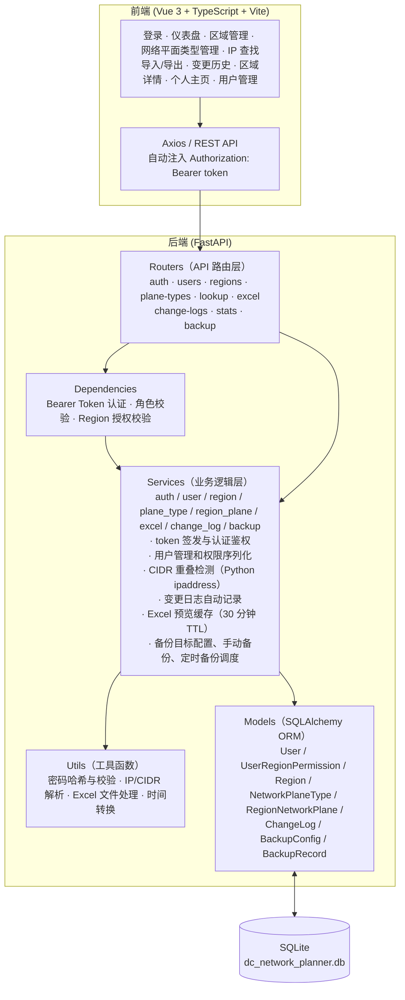
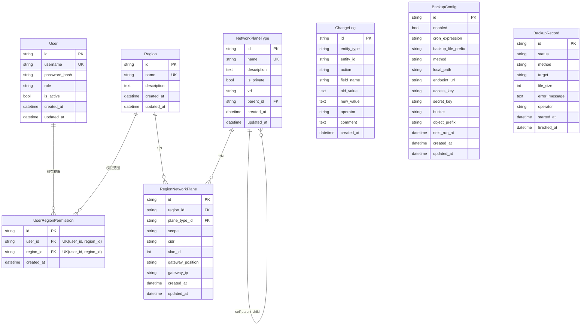
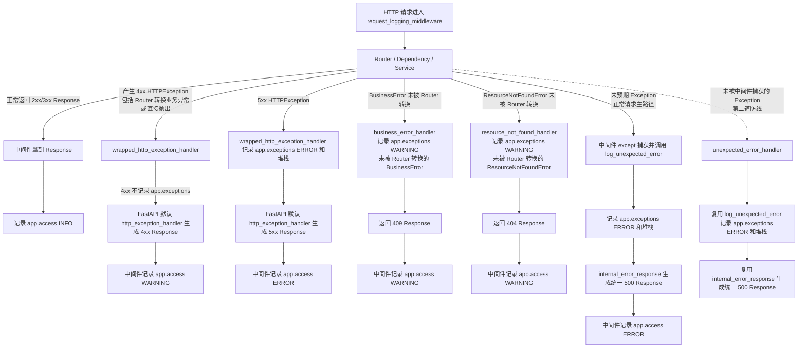
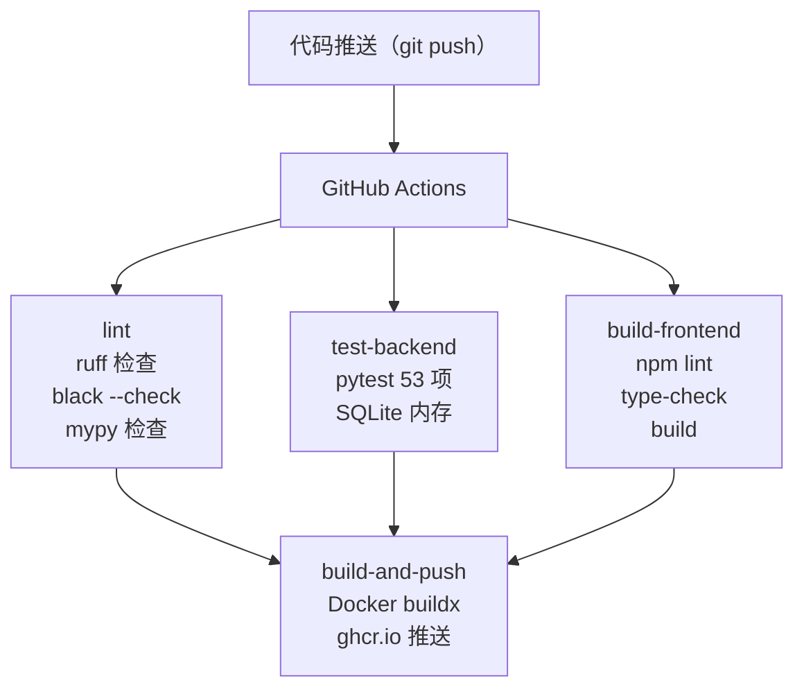

# DC Network Planner - 架构设计文档

## 1. 核心需求

| 需求 | 说明 |
|---|---|
| Region 管理 | 查询、创建、更新、删除数据中心 Region |
| 网络平面自定义 | 可自定义网络平面类型（如管理平面、业务平面、存储平面等），每个 Region 可独立创建/删除对应的网络平面实例 |
| 网络平面地址管理 | 管理每个 Region 下各网络平面的 CIDR、VLAN ID、网关位置和网关 IP |
| IP 查重 | 给定 IP 地址或 CIDR 地址段，快速检查是否已被分配，返回所属 Region 和网络平面 |
| Excel 导入 | 按模板格式上传 Excel，支持预览验证后批量导入 |
| Excel 导出 | 按 Region 过滤导出为 Excel |
| 变更追溯 | 所有数据操作（创建/更新/删除/导入）自动记录变更日志，可查询操作者、时间、变更内容 |
| 数据备份 | 支持配置备份目标，手动立即备份，按五段式 cron 表达式自动备份 |
| 认证与权限 | 支持本地账号登录，按 administrator / user 两类角色控制全局配置和 Region 业务数据写权限 |

## 2. 技术选型

| 层级 | 技术 | 版本 | 选型理由 |
|---|---|---|---|
| 后端框架 | Python FastAPI | 0.115+ | 高性能异步框架，自动生成 OpenAPI 文档，Pydantic 校验 |
| ORM | SQLAlchemy | 2.0+ | 成熟可靠，支持迁移工具 Alembic |
| 数据库 | SQLite | 3.x | 零配置，单文件存储，适合 MVP 阶段 |
| 数据库迁移 | Alembic | 1.14+ | SQLAlchemy 官方迁移工具 |
| Excel 处理 | openpyxl | 3.1+ | 纯 Python Excel 读写，无系统依赖 |
| 对象存储 | boto3 | 1.34+ | 支持 S3 兼容对象存储备份 |
| 时区处理 | zoneinfo | Python 内置 | 使用 IANA 时区名解释业务时间 |
| IP 处理 | ipaddress | Python 内置 | 标准库，CIDR 解析与重叠检测 |
| 前端框架 | Vue 3 | 3.5+ | Composition API，体积小，生态丰富 |
| 前端语言 | TypeScript | 6.0+ | 为 API 响应、表单和页面状态提供静态类型约束 |
| 前端构建 | Vite | 5.4+ | 极速 HMR，开箱即用 |
| 前端质量检查 | ESLint | 9.x | Vue/TypeScript 代码质量检查 |
| UI 组件库 | Element Plus | 2.8+ | 中文友好，表格/表单/对话框组件丰富 |
| 状态管理 | Pinia | 2.2+ | Vue 3 官方推荐状态管理 |
| HTTP 客户端 | Axios | 1.7+ | 拦截器、请求/响应转换 |
| 前后端通信 | RESTful API | - | 简单通用，便于调试 |

## 3. 整体架构



### 3.1 后端分层架构

后端采用经典的三层架构：

1. **Router 层** - API 端点定义，请求参数解析，HTTP 状态码转换和响应序列化。依赖 `get_db` 获取数据库会话，依赖 `get_current_user` / `require_administrator` / `ensure_region_business_write_allowed` 完成认证与授权；不直接访问 SQLAlchemy Model。
2. **Service 层** - 核心业务逻辑和数据访问，包括 CIDR 重叠检测、变更日志记录、Excel 导入业务校验、列表聚合统计和响应所需业务上下文。Router 层调用 Service 层，Service 层操作 Model 层；同一请求链路中已获取并校验过的实体或上下文应继续复用，避免重复查询同一业务对象。Excel 工具函数只负责工作簿读写、表头匹配和单元格基础清理，空作用域默认 Global、VLAN 合法性等业务解释在 Service 层完成。
3. **Model 层** - SQLAlchemy ORM 模型，定义数据表结构和关系。通过 Alembic 管理数据库迁移。

### 3.2 前端组件架构

前端采用 Vue 3 Composition API + TypeScript + Vue Router 组织页面：

- **App.vue** - 根组件，仅包含 `<router-view />`
- **AppLayout.vue** - 布局组件，包含侧边栏导航 + 顶栏（面包屑 + 当前用户入口 + 退出登录）+ 内容区
- **views/** - 页面组件，每个对应一个路由
- **api/** - Axios 请求封装模块，按业务领域拆分，请求参数和响应数据使用 TypeScript 类型约束
- **stores/** - Pinia 状态管理，存储登录 token、当前用户、Region 授权和侧边栏状态
- **router/** - 路由配置，懒加载页面组件，并通过全局守卫保护登录态与管理员页面
- **types/** - 前端业务类型定义，覆盖 Region、网络平面、用户、备份、导入导出和统计响应

## 4. 数据模型设计

### 4.1 实体关系图



### 4.2 核心表设计

SQLite 连接初始化时通过 SQLAlchemy `connect` 事件显式执行 `PRAGMA foreign_keys=ON`，确保表结构中的 FK 和 `ON DELETE` 约束在运行时生效。测试用内存 SQLite 使用同一连接配置，避免测试环境与实际运行环境的外键行为不一致。

#### users

| 字段 | 类型 | 约束 | 说明 |
|---|---|---|---|
| id | String(36) UUID | PK | UUID v4 |
| username | String(100) | NOT NULL, UNIQUE, INDEX | 登录用户名 |
| password_hash | String(255) | NOT NULL | PBKDF2-HMAC-SHA256 密码哈希 |
| role | String(20) | NOT NULL, INDEX | administrator/user |
| is_active | Boolean | NOT NULL, default=true | 是否允许登录 |
| created_at | DateTime | NOT NULL | 创建时间 |
| updated_at | DateTime | NOT NULL, onupdate | 更新时间 |

本地账号表。系统启动时若 `users` 表为空，会创建一个 bootstrap administrator。

#### user_region_permissions

`user_region_permissions` 是用户与其被授权 Region 的权限关联表，用来表达普通 `user` 可写入哪些 Region 内的业务数据；
它不是用户所属 Region、驻场 Region 或组织归属关系。

| 字段 | 类型 | 约束 | 说明 |
|---|---|---|---|
| id | String(36) UUID | PK | UUID v4 |
| user_id | String(36) | FK -> users.id, CASCADE, INDEX | 用户 ID |
| region_id | String(36) | FK -> regions.id, CASCADE, INDEX | 被授权写入业务数据的 Region |
| created_at | DateTime | NOT NULL | 创建时间 |

约束：`UNIQUE(user_id, region_id)`，防止同一个用户重复获得同一个 Region 的授权。

普通 `user` 的 Region 业务写权限授权表。`administrator` 不依赖此表获得权限；普通 `user`
只能写入被授权 Region 的业务数据。

#### regions

| 字段 | 类型 | 约束 | 说明 |
|---|---|---|---|
| id | String(36) UUID | PK | UUID v4 |
| name | String(100) | NOT NULL, UNIQUE, INDEX | 如 "北京数据中心" |
| description | Text | NULLABLE | 自由文本 |
| created_at | DateTime | NOT NULL | 创建时间 |
| updated_at | DateTime | NOT NULL, onupdate | 更新时间 |

#### network_plane_types

| 字段 | 类型 | 约束 | 说明 |
|---|---|---|---|
| id | String(36) UUID | PK | UUID v4 |
| name | String(100) | NOT NULL, UNIQUE, INDEX | 如 "管理平面" |
| description | Text | NULLABLE | 描述 |
| is_private | Boolean | NOT NULL, default=false | 是否私网 |
| vrf | String(100) | NULLABLE | 所属 VRF |
| parent_id | String(36) | FK -> self.id, RESTRICT, NULLABLE | 父级网络平面类型；NULL 表示根类型 |
| created_at | DateTime | NOT NULL | 创建时间 |
| updated_at | DateTime | NOT NULL, onupdate | 更新时间 |

全局目录表，所有 Region 共享。网络平面父子层级在此表维护，所有 Region 使用同一棵类型树，最多 3 级嵌套。

#### region_network_planes

| 字段 | 类型 | 约束 | 说明 |
|---|---|---|---|
| id | String(36) UUID | PK | UUID v4 |
| region_id | String(36) | FK -> regions.id, CASCADE | 所属 Region |
| plane_type_id | String(36) | FK -> network_plane_types.id, RESTRICT | 网络平面类型 |
| scope | String(100) | NOT NULL, default="Global", UNIQUE(region_id, plane_type_id, scope) | 平面实例作用域，如业务AZ1；Global 表示作用域为全局 |
| cidr | String(43) | NOT NULL | CIDR 地址段，如 "10.0.0.0/22" |
| vlan_id | Integer | NULLABLE, INDEX, 1-4094 | VLAN ID |
| gateway_position | String(255) | NULLABLE | 网关位置，如一对交换机设备名称或端口位置 |
| gateway_ip | String(39) | NULLABLE | 网关 IP 地址 |
| created_at | DateTime | NOT NULL | 创建时间 |
| updated_at | DateTime | NOT NULL, onupdate | 更新时间 |

Region 维度的网络平面实例和 CIDR 配置表。树形结构由 `network_plane_types.parent_id` 派生；同一 Region 内同一平面类型可按 `scope` 创建多个实例，空作用域在接口层归一化为 `Global`。Region 内 CIDR 不允许与非层级关系平面重叠；子平面的 CIDR 必须是同 Region 下父级平面 CIDR 的子网段。CIDR 是否允许跨 Region 重叠由启动期静态配置 `ALLOW_CIDR_OVERLAP_ACROSS_REGIONS` 控制。

`vlan_id`、`gateway_position`、`gateway_ip` 描述该 Region 中网络平面实例本身的网关信息。`vlan_id` 在同一 Region 内不能重复，是否允许跨 Region 重复由启动期静态配置 `ALLOW_VLAN_OVERLAP_ACROSS_REGIONS` 控制；为空时不参与重复性检查。填写 `gateway_ip` 时必须位于该平面的 CIDR 范围内；私网平面推荐使用 CIDR 内第一个可用 IP，非私网平面推荐使用最后一个可用 IP，不符合推荐值时前端提示但不阻止保存。CIDR 格式和网关 IP 归属这类不依赖数据库的输入错误会在访问网络平面类型、Region 平面实例等数据库数据前先被拦截。

#### change_logs

| 字段 | 类型 | 约束 | 说明 |
|---|---|---|---|
| id | String(36) UUID | PK | UUID v4 |
| entity_type | String(50) | NOT NULL, INDEX | 实体类型 |
| entity_id | String(36) | NOT NULL, INDEX | 实体 ID |
| action | String(20) | NOT NULL | create/update/delete/import |
| field_name | String(100) | NULLABLE | update 时记录字段名 |
| old_value | Text | NULLABLE | JSON 或纯文本 |
| new_value | Text | NULLABLE | JSON 或纯文本 |
| operator | String(100) | NOT NULL | 操作者 |
| comment | Text | NULLABLE | 备注 |
| created_at | DateTime | NOT NULL, INDEX | 创建时间 |

**设计决策**：显式服务层变更日志记录，而非 SQLAlchemy 事件监听。Service 在每次 mutate 操作后调用 `log_change()`，更可控、可测试。`entity_id` 保留 UUID 作为内部关联和筛选键；面向用户展示的 `old_value`、`new_value`、`comment` 必须优先记录 Region 名称、网络平面类型名称、作用域、CIDR 等可读业务描述，不直接暴露外键 UUID。

#### backup_configs

| 字段 | 类型 | 约束 | 说明 |
|---|---|---|---|
| id | String(36) UUID | PK | UUID v4 |
| enabled | Boolean | NOT NULL, default=false | 是否启用定时备份任务 |
| cron_expression | String(100) | NOT NULL, default='0 2 * * *' | 五段式 cron 表达式：分 时 日 月 周，秒固定为 0 |
| backup_file_prefix | String(200) | NOT NULL, default='dc_network_planner_data_backup_' | 备份文件名前缀，实际文件名为 `{backup_file_prefix}{YYYYMMDDHHMMSS}` |
| method | String(30) | NOT NULL, default='local' | local/object_storage |
| local_path | String(500) | NULLABLE | 本地备份目录 |
| endpoint_url | String(500) | NULLABLE | S3 兼容对象存储 Endpoint |
| access_key | String(200) | NULLABLE | 对象存储 AK |
| secret_key | String(500) | NULLABLE | 对象存储 SK |
| bucket | String(200) | NULLABLE | 对象存储 Bucket |
| object_prefix | String(300) | NULLABLE | 对象 Key 前缀 |
| next_run_at | DateTime | NULLABLE | 下次定时备份时间 |
| created_at | DateTime | NOT NULL | 创建时间 |
| updated_at | DateTime | NOT NULL, onupdate | 更新时间 |

**设计决策**：备份目标配置、文件命名配置与定时任务配置存在同一张全局配置表中，但语义上分离。`method/local_path/object_storage/backup_file_prefix` 是手动备份和定时备份共享的备份目标与命名配置；`enabled/cron_expression` 只控制自动触发。

#### backup_records

| 字段 | 类型 | 约束 | 说明 |
|---|---|---|---|
| id | String(36) UUID | PK | UUID v4 |
| status | String(20) | NOT NULL | success/failed |
| method | String(30) | NOT NULL | 本次执行使用的备份方式 |
| target | String(800) | NULLABLE | 本地文件路径或完整对象存储备份路径 |
| file_size | Integer | NULLABLE | 备份文件大小（字节） |
| error_message | Text | NULLABLE | 失败原因 |
| operator | String(100) | NOT NULL | 操作者，定时任务为 system |
| started_at | DateTime | NOT NULL | 开始时间 |
| finished_at | DateTime | NULLABLE | 完成时间 |

## 5. API 设计

### 5.1 API 端点总览

#### 健康检查

| 方法 | 路径 | 说明 |
|---|---|---|
| GET | `/api/health` | 健康检查 |

#### 认证与用户

| 方法 | 路径 | 说明 |
|---|---|---|
| POST | `/api/auth/login` | 用户名密码登录，返回 Bearer token |
| GET | `/api/auth/me` | 查询当前登录用户、角色、Region 授权和权限集合 |
| PUT | `/api/auth/password` | 当前登录用户修改自己的密码 |
| GET/POST | `/api/users` | 用户列表/创建用户（administrator） |
| PUT/DELETE | `/api/users/{id}` | 更新/删除用户（administrator）；不允许删除当前登录用户 |
| POST | `/api/users/{id}/reset-password` | 重置用户密码（administrator） |

#### Region 与网络平面

| 方法 | 路径 | 说明 |
|---|---|---|
| GET/POST | `/api/regions` | 列表/创建 Region；创建需 administrator |
| GET/PUT/DELETE | `/api/regions/{id}` | Region 详情（含平面树）/更新/删除；更新和删除需 administrator；删除 Region 会级联删除该 Region 下所有网络平面并清理用户 Region 授权，审计日志记录本次删除影响的网络平面实例数和用户授权数 |
| GET/POST | `/api/regions/{id}/planes` | 查询 Region 平面树/创建指定网络平面类型实例；写入需 Region 业务权限 |
| PUT/DELETE | `/api/regions/{id}/planes/{plane_id}` | 更新 Region 平面业务字段（不允许修改网络平面类型）/删除平面节点；若存在子平面则拒绝删除，需用户先自底向上手动删除子平面；需 Region 业务权限 |

#### 网络平面类型

| 方法 | 路径 | 说明 |
|---|---|---|
| GET/POST | `/api/network-plane-types` | 列表/创建网络平面类型，支持维护父级类型；创建需 administrator |
| GET/PUT/DELETE | `/api/network-plane-types/{id}` | 类型详情/更新/删除，支持维护父级类型；更新和删除需 administrator；存在子类型或已被 Region 使用时拒绝删除 |

#### 查询与导入导出

| 方法 | 路径 | 说明 |
|---|---|---|
| GET | `/api/lookup` | IP/CIDR 查询；参数 `q` 必填，`exact` 可选且默认 true |
| GET | `/api/excel/template` | 下载导入模板 |
| POST | `/api/excel/import/preview` | 上传 Excel 并预览校验结果 |
| POST | `/api/excel/import/confirm` | 确认导入预览数据，逐行创建网络平面 |
| GET | `/api/excel/export` | 导出 Excel，支持按 Region 筛选 |

#### 审计与统计

| 方法 | 路径 | 说明 |
|---|---|---|
| GET | `/api/change-logs` | 变更日志查询，支持实体、操作、操作者、时间和分页筛选 |
| GET | `/api/stats` | 统计数据 |

#### 备份

| 方法 | 路径 | 说明 |
|---|---|---|
| GET/PUT | `/api/backup/config` | 查询/更新备份配置；更新需 administrator |
| POST | `/api/backup/run` | 立即执行一次备份；需 administrator |
| GET | `/api/backup/records` | 查询备份执行历史 |

### 5.2 关键接口详情

#### 列表默认排序

后端统一定义列表类接口的默认返回顺序，前端默认按接口顺序展示。时间序列数据按时间由近到远排序；其他业务数据按名称升序排序：

- 变更历史、仪表盘最近变更：`created_at DESC`
- 备份历史：`started_at DESC`
- Region 列表、用户列表、网络平面类型列表：名称升序
- Region 网络平面树、IP/CIDR 查询结果、Excel 导出：Region 名称、网络平面类型名称、`scope`、CIDR 升序
- 统计分布：按展示名称升序；涉及私网/非私网分组时固定 `非私网` 在前、`私网` 在后；导入预览保持 Excel 原始行号顺序

#### Excel 导出字段

网络平面明细导出包含：区域、网络平面类型、父级网络平面类型、作用域、是否私网、VRF、IP地址段(CIDR)、VLAN ID、网关位置、网关IP、更新时间。

#### IP 查重 (GET /api/lookup)

查询参数：`q` (IP/CIDR), `exact` (bool)

处理逻辑：
1. 先尝试解析为单 IP（`parse_ip`）
2. 若单 IP 解析失败，尝试解析为 CIDR（`parse_cidr`）
3. 若两种解析均失败，直接返回 400，不执行网络平面查询
4. IP 查询返回包含该 IP 的所有分配；CIDR 查询在 `exact=true` 时精确匹配，在 `exact=false` 时重叠匹配
5. 响应按网络平面父子关系返回树形结果；如果命中的是子平面，会额外带出父级上下文节点，`total` 只统计真正命中的平面，节点用 `is_match` 区分命中项与上下文
6. 在 Python 内存中使用 `ipaddress` 模块进行包含/重叠检测（SQLite 无原生 CIDR 类型）

#### Excel 导入（两阶段）

```
第一阶段: POST /api/excel/import/preview
  → 上传 .xlsx Excel → 解析验证和 Region 导入权限标注 → 返回有效行预览数据 + preview_id
  → 解析前校验表头必须匹配当前导入模板，不兼容缺少作用域列等非当前模板结构
  → Excel 工具层只读取工作簿、跳过空行并按模板列返回清理后的原始单元格值
  → Service 层解释导入业务字段：空作用域归一化为 Global，VLAN 原始值解析为整数并校验 1-4094 范围
  → 导入模板表头标注必填/选填；作用域空值默认 Global，CIDR 表头给出格式示例，VLAN ID 表头标注 1-4094 范围
  → 导入模板基于当前数据库生成 Region 名称和网络平面类型名称下拉候选项，便于用户选择已有数据
  → 预览阶段校验网关 IP 格式及其是否位于本行 CIDR 范围内
  → 当前用户无权管理的 Region 行进入 error_rows，提示仅提供预览功能、不能实际导入
  → error_rows 携带 region_name 和 error_type，前端按权限/校验/业务错误分组展示
  → 预览数据在内存缓存 30 分钟

第二阶段: POST /api/excel/import/confirm
  → 传入 preview_id，后端使用当前登录用户作为操作者
  → 再次检查预览数据涉及的所有 Region 是否都允许当前用户写入
  → 逐行创建 Region 网络平面，逐行检查 CIDR 重叠并收集业务错误
  → 逐条记录变更日志
```

#### 备份配置与执行

```
GET /api/backup/config
  → 返回全局备份配置；首次访问时创建默认配置

PUT /api/backup/config
  → 更新备份目标和定时任务配置
  → backup_file_prefix 控制备份文件名前缀，实际文件名为 backup_file_prefix + YYYYMMDDHHMMSS
  → cron_expression 使用五段式 cron：分 时 日 月 周，秒固定为 0
  → 支持 *、数字、列表、范围和步长，例如 0 2 * * *、*/15 * * * *、30 3 * * 1-5
  → cron_expression 和 backup_file_prefix 这类不依赖现有配置的格式错误会在读取数据库配置前先被拦截
  → 保存时校验备份目标可用
  → 启用定时任务时按 cron_expression 计算 next_run_at

POST /api/backup/run
  → 立即执行一次备份
  → 即使定时任务 disabled，也会使用当前备份目标配置执行
  → 成功或失败都会写入 backup_records

GET /api/backup/records
  → 分页查询备份历史
```

### 5.3 错误处理

业务错误返回统一格式：`{ "detail": "错误描述" }`。FastAPI/Pydantic 参数校验错误（422）中 `detail` 为校验错误列表。

| 场景 | HTTP 状态码 |
|---|---|
| 未登录或 token 无效 | 401 |
| 已登录但无权限 | 403 |
| 实体不存在 | 404 |
| 参数校验失败 | 422 |
| 资源冲突（重复名称/重叠 CIDR） | 409 |
| 服务器内部错误 | 500 |

Service 层使用 `ResourceNotFoundError` 表达明确的实体不存在场景，使用 `BusinessError` 表达业务规则冲突。Router 层负责 HTTP 语义转换，因为不同接口最清楚同一类业务错误应返回 400、403、404、409 还是其他状态码；全局异常处理器只作为兜底，处理未被 Router 转换的 `BusinessError` / `ResourceNotFoundError`，记录 `HTTPException` 日志，并把漏网的未预期异常转换为统一 500 响应，避免异常直接变成无结构响应。

### 5.4 系统日志

系统日志与业务变更日志分离：`change_logs` 只记录用户可追溯的数据变更；系统日志用于排查 HTTP 请求、后台任务和未预期异常，不落数据库，也不提供查询 API 或前端页面。当前阶段通过文件搜索完成排障。

后端启动时由 `app.logging_config.setup_logging()` 统一初始化 root logger，写入控制台和轮转文件。文件日志固定写入 JSON Lines，默认路径为 `backend/logs/app.log`，便于 `rg`、`jq` 或后续日志采集系统处理。`backend/logs/` 不提交到仓库。

HTTP 请求由全局中间件生成或透传 `X-Request-ID`，并在响应头返回同一个值；缺失、空值或超过 128 字符的 request ID 会被替换为后端生成的 UUID。请求日志记录 `request_id`、`method`、`path`、`status_code`、`duration_ms`、`client_ip`、`username` 和查询参数；文件日志每行都会记录 `source_file`、`source_line`、`source_func`，用于定位日志产生位置。请求体不记录，避免密码、token、对象存储密钥等敏感信息进入日志。日志格式化阶段会递归脱敏 `password`、`token`、`authorization`、`secret`、`secret_key`、`access_key`、`jwt`、`cookie` 等结构化字段，并对 message、异常文本中的常见 `key=value` / `key: value` 凭据片段做兜底脱敏。`/api/health` 健康检查不写访问日志，避免 Docker healthcheck 噪声。

日志记录边界保持分层：HTTP 访问摘要由中间件统一记录，异常响应由全局异常处理器统一记录；普通 CRUD 成功路径不额外手写系统日志，避免与访问日志和业务变更日志重复。Service 或后台任务只在中间件无法覆盖的关键副作用和故障点手动记录系统日志，例如备份执行失败、对象存储探测清理失败、备份调度循环异常等。命令行入口（如 seed 脚本）可记录执行进度日志，方便非 HTTP 场景排查。

请求异常日志链路：



异常分级策略：

| 场景 | `app.access` | `app.exceptions` | 打印堆栈 |
|---|---|---|---|
| 正常请求（2xx/3xx） | INFO | 不记录 | 否 |
| Router / 依赖产生的 4xx `HTTPException` | WARNING | 不记录 | 否 |
| 漏网 `BusinessError` / `ResourceNotFoundError` | WARNING | WARNING | 否 |
| 5xx `HTTPException` | ERROR | ERROR | 是 |
| 未预期 `Exception` | ERROR | ERROR | 是 |

后台任务（如备份调度）复用同一日志体系；非 HTTP 入口没有 `request_id` 时，对应字段为空，仍通过 logger 名称和消息定位来源。Docker Compose 部署会将 `LOG_DIR` 设置为 `/app/data/logs`，日志随数据库一起保存在持久化 volume 中；其他部署方式可通过环境变量覆盖日志目录。

### 5.5 认证与权限

除 `/api/health` 和 `/api/auth/login` 外，业务 API 均要求 `Authorization: Bearer <token>`。后端通过统一依赖解析当前用户，并在 Router 层做角色和 Region 授权校验。

| 角色 | 读权限 | 写权限 |
|---|---|---|
| administrator | 所有业务数据、配置数据、用户数据 | 用户与权限分配、Region 元数据管理、全局配置（网络平面类型、备份配置等） |
| user | 所有业务数据、配置数据 | 仅限已授权 Region 内业务数据（网络平面树、Excel 导入确认） |

权限边界：

1. `administrator` 可以创建、更新、删除 Region 基础对象（Region 元数据），对应能力标签为 `manage:region-metadata`。
2. `administrator` 不写 Region 内业务数据，避免全局管理员直接修改业务规划。
3. `user` 不能管理用户、Region 元数据和全局配置。
4. `administrator` 可以管理其他用户账号，但不能删除当前登录用户。
5. 更新用户角色或禁用用户时仍会保护最后一个启用的 `administrator`，防止系统失去可登录管理员。
6. Excel 导入预览会将当前用户无权管理的 Region 行标记为错误行，并提示仅提供预览功能、不能实际导入；确认导入仍会二次检查预览数据覆盖的所有 Region，任一 Region 未授权则拒绝导入。
7. 变更日志的 `operator` 统一使用当前登录用户 `username`。
8. `/api/auth/me` 返回的 `permissions` 是给前端展示和未来扩展使用的能力标签；当前后端实际放行逻辑以 `role` 和 `user_region_permissions` 授权校验为准。

### 5.6 启动初始化

应用启动时执行 `ensure_bootstrap_admin()`：当 `users` 表为空时，根据配置创建第一个 `administrator`。相关配置：

| 配置项 | 默认值 | 说明 |
|---|---|---|
| `JWT_SECRET_KEY` | `change-me-in-production` | token 签名密钥，生产环境必须覆盖 |
| `JWT_ACCESS_TOKEN_EXPIRE_MINUTES` | `480` | 访问 token 有效期 |
| `BOOTSTRAP_ADMIN_USERNAME` | `admin` | 初始管理员用户名 |
| `BOOTSTRAP_ADMIN_PASSWORD` | `admin` | 初始管理员密码，生产环境必须覆盖 |

## 6. 关键技术决策

### 6.1 RegionNetworkPlane 承载网段

**决策**：不再单独维护额外的网段明细表，`RegionNetworkPlane` 本身就是 Region 内的一条网络平面网段记录。

**理由**：业务上 Region 内创建的网络平面即代表一个具体网段，CIDR、VLAN、网关位置和网关 IP 都属于这条网段记录。移除额外的网段明细层可以减少重复表达，让查询、导入导出和权限边界都围绕 `region_network_planes` 展开。

### 6.2 Python 端 CIDR 重叠检测

**决策**：使用 Python `ipaddress` 标准库进行 CIDR 解析和重叠检测，而非编写原始 SQL。

**理由**：SQLite 无原生 CIDR 数据类型。`ipaddress.IPv4Network.overlaps()` 提供了正确的语义。MVP 数据量下内存扫描性能绰绰有余。

### 6.3 全局网络平面类型树

**决策**：网络平面的父子层级只维护在 `network_plane_types.parent_id`，所有 Region 共享同一棵类型树。`region_network_planes` 表示某个 Region 在某个作用域创建了哪个类型的实例，以及该 Region 下该类型实例对应的 CIDR。

**理由**：网络平面类型之间的嵌套关系是长期全局规则，不随 Region 改变。把层级放在类型表中，可避免不同 Region 维护出不一致的父子结构；Region 详情页只负责创建该Region内的网络平面实例。

**核心约束**：

1. 添加或更新子类型平面时，父级类型必须已在同一 Region 中存在有效父实例。
2. 子类型平面优先挂载到同 `scope` 的父平面；如果同 `scope` 父平面不存在，允许回退挂载到 `Global` 父平面。回退挂载指子平面自身仍保留原 `scope`，但树形关系上挂在 `Global` 父平面下；其他作用域的父平面不可作为有效父级。
3. 子类型平面的 CIDR 必须落在实际挂载父平面的 CIDR 范围内。
4. Region 内 CIDR 不允许与非有效父子/祖先关系的网络平面重叠；有效父子/祖先关系允许 CIDR 包含关系，但子平面必须落在父平面范围内。CIDR 是否允许跨 Region 重叠由 `ALLOW_CIDR_OVERLAP_ACROSS_REGIONS` 控制。
5. 更新父平面 CIDR 时，已有子孙平面必须仍然落在新的父平面 CIDR 范围内。
6. 网关 IP 必须位于当前平面 CIDR 范围内；私网平面推荐第一个可用 IP，非私网平面推荐最后一个可用 IP，不符合推荐值只返回提示。
7. VLAN ID 在同一 Region 内不能重复，是否允许跨 Region 重复由 `ALLOW_VLAN_OVERLAP_ACROSS_REGIONS` 控制；为空表示不配置 VLAN，且不参与重复性检查。
8. 删除某个 Region 下的平面时，只允许删除没有子平面的叶子节点；如果该平面下仍有实际挂载的子平面，则拒绝删除并提示用户先删除子平面。回退挂载到 `Global` 父平面的子平面也视为该 `Global` 实例的实际子平面，会阻止删除该父平面。
9. 删除 Region 允许整体废弃该 Region，并通过 ORM 级联删除其下所有网络平面实例、清理用户 Region 授权；删除前会统计受影响的网络平面实例数和用户授权数并写入 Region 删除审计日志。前端在 Region 下存在网络平面实例时要求输入 Region 名称二次确认。
10. 删除网络平面类型时，只允许删除未被 Region 使用且没有子类型的叶子类型；数据库外键也使用 `RESTRICT` 拒绝直接删除仍有子类型或 Region 平面实例引用的类型。
11. `region_network_planes` 使用 `UNIQUE(region_id, plane_type_id, scope)` 防止同一 Region 的同一作用域重复创建同一个网络平面类型的实例。
12. `region_network_planes.vlan_id` 建立单列索引，用于写入时快速定位同 VLAN 记录。
13. `network_plane_types.is_private` 按类型树继承：子类型属性值必须与父类型一致，否则后端拒绝请求；根类型变更私网/公网属性时会同步整棵后代子树。

**前端交互**：网络平面类型页面提供“父级平面”选择，用于维护全局类型树；选择父级后，私网/公网属性自动继承父级并禁止单独编辑。

### 6.4 服务层变更日志

**决策**：Service 层显式调用 `log_change()`，而非 SQLAlchemy 事件监听器。

**理由**：事件监听器需要额外的 `session.info` 传递操作者上下文，且隐含行为难以调试。Service 层方式是显式的、可单元测试的。

**展示约束**：变更日志表中的 `entity_id` 只用于内部定位；写入 `old_value`、`new_value`、`comment` 时应把 Region、父级网络平面类型、Region 网络平面实例等外键转成用户可识别的名称或业务描述。

### 6.5 UUID 主键

**决策**：所有表使用 UUID v4 主键，存储为 `String(36)`。

**理由**：UUID 防止 ID 枚举攻击，便于未来数据迁移/合并（分布式无冲突）。UUID 适合作为内部主键和 API 关联键，但不适合作为面向普通用户的变更历史描述；用户可见日志应展示业务名称和上下文。

### 6.6 两阶段 Excel 导入

**决策**：预览（解析验证）→ 确认（批量写入）两阶段。

**理由**：预览步骤让用户在提交前检查解析结果和验证错误。确认时只需传入 preview_id，避免大数据量重新传输。预览缓存 30 分钟防止内存无限增长。

**边界**：当前导入解析仅支持 `.xlsx` 工作簿；Excel 工具层只负责工作簿打开、模板表头匹配、空行跳过和单元格基础清理，不解释 Region 网络平面的业务规则。空作用域默认 Global、VLAN 整数与范围、CIDR/IP 格式、Region 和网络平面类型存在性、用户 Region 写权限都在 Service 预览阶段校验。预览响应中的 `rows` 只包含可确认导入的有效行，错误行通过 `error_rows` 返回。预览阶段会按当前用户的 Region 业务写权限提前标注无权导入的行，并在错误行中携带 Region 名称与错误类型，便于前端区分权限、校验和业务错误。确认阶段仍以服务端缓存的有效行为准，并再次执行 Region 权限检查。确认阶段只把可预期的业务错误按行收集，数据库或运行时异常交由请求事务统一回滚。

### 6.7 前端本地状态管理

**决策**：每个页面独立 fetch 数据，Pinia 仅存储会话状态（token、当前用户、权限/Region 授权）和少量 UI 状态（侧边栏状态）。

**理由**：共享实体状态引入一致性挑战（跨页面数据同步），没有 WebSocket 难以保持同步。独立 fetch 更简单、正确。

### 6.8 数据库备份机制

**决策**：使用 `backup_configs` 保存全局备份配置，使用 `backup_records` 记录每次执行结果。FastAPI lifespan 启动轻量后台线程 `BackupScheduler`，按固定间隔检查 `next_run_at` 是否到期。

**执行逻辑**：

1. 应用启动时创建表并启动后台调度器
2. 调度器定期读取全局配置，未启用时跳过
3. 当前时间到达 `next_run_at` 时调用 `run_backup()`
4. 备份完成后按 `cron_expression` 重新计算下一次执行时间
5. 手动备份复用同一个 `run_backup()`，但不依赖 `enabled`

**备份文件生成**：当前数据库为 SQLite，服务从 SQLAlchemy Session 获取底层 SQLite 连接，通过 `iterdump()` 导出 SQL，再写入新的备份文件。文件命名格式为 `{backup_file_prefix}{YYYYMMDDHHMMSS}`，默认如 `dc_network_planner_data_backup_20260428143005`。

**数据库恢复脚本**：恢复入口为 `backend/scripts/restore_database.py`，可通过 `cd backend && make restore-db BACKUP=./backups/<backup_file>` 调用。脚本只支持 SQLite：先按应用配置解析目标数据库路径，再校验备份文件是有效 SQLite 且包含当前项目必要数据表；恢复前默认复制当前数据库为 `*.pre_restore_<timestamp>_<id>.db` 安全快照，随后使用 SQLite backup API 写入临时数据库文件并原子替换目标数据库。恢复前应停止后端服务，避免运行中的进程继续持有旧数据库连接；对象存储备份需要先下载成本地文件再执行脚本。

**保存配置校验决策**：保存备份配置时执行轻量目标探测，不触发真实数据库备份。

**理由**：备份配置保存成功应尽量代表目标路径、对象存储凭据和 Bucket 可用，但保存表单不应产生完整备份文件、对象存储流量和执行历史噪声。轻量探测能在保存阶段暴露路径不可写、AK/SK 错误、Bucket 不存在等配置问题，同时保持“保存配置”和“立即备份”的语义边界清晰。

**探测方式**：本地文件模式会创建目录并写入/删除一个探测文件；对象存储模式会使用当前 Endpoint、AK/SK、Bucket 和对象前缀上传一个空探测对象，并尽量删除该探测对象。

**Cron 表达式解析与下次执行时间计算**：

备份调度使用纯 Python 实现五段式 cron 解析与匹配，不引入额外调度依赖（如 APScheduler、Celery），保持 MVP 部署简单。

1. **表达式格式**：`分 时 日 月 周`，秒固定为 0。支持 `*`（全匹配）、精确数字、逗号列表（`,`）、范围（`-`）和步长（`/`），例如 `0 2 * * *`、`*/15 * * * *`、`30 3 * * 1-5`。

2. **解析过程**：
   - 按空格拆分为 5 个字段，字段数不对直接报错。
   - 每个字段按逗号拆分为片段，逐个解析后取并集。
   - 片段解析优先级：步长（`/`）→ 范围（`-`）→ 通配（`*`）→ 精确数字。
   - 最终生成 5 个整数集合，分别代表允许的分钟、小时、日期、月份、星期值。

3. **匹配规则**：
   - 分钟、小时、月份直接判断候选时间是否落在对应集合内。
   - 日期和星期采用类 Unix cron 语义：当日期和星期都不是全匹配（`*`）时，两者为"或"关系；只要其中一个满足即可。当其中一个为 `*` 时，两者为"与"关系。星期字段中 `0` 和 `7` 都视为周日。

4. **下次执行时间计算**：
   - 将基准时间（如当前时间）转换为应用业务时区（`APP_TIMEZONE`，默认 `Asia/Shanghai`）。
   - 从基准时间的**下一分钟**开始（秒和微秒清零，`+1 分钟`），逐分钟递增遍历。
   - 对每个候选时间调用匹配规则，第一个满足全部条件的时间点即为下次执行时间。
   - 遍历上限为 5 年的分钟数（约 260 万分钟），超限时报错，防止 cron 表达式过于稀疏导致无限循环。
   - 返回结果保持与输入基准时间相同的时区信息。

5. **调度触发**：后台线程按固定间隔（默认 60 秒）轮询，读取全局备份配置，检查 `next_run_at` 是否已到期。到期时执行备份，成功后根据 cron 表达式重新计算并更新 `next_run_at`。

**备份目标**：

- local：文件直接保存到 `local_path`
- object_storage：先生成临时文件，再通过 boto3 上传到 S3 兼容对象存储。完整备份路径为 `endpoint_url + bucket + object_prefix + 备份文件名`；实现会归一化斜杠，记录为 `{endpoint_url}/{bucket}/{object_prefix}/{backup_file_prefix}{YYYYMMDDHHMMSS}`

**限制**：当前实现只支持 SQLite 数据库备份与恢复；若未来切换 PostgreSQL/MySQL，需要替换备份生成和恢复策略（如 pg_dump/mysqldump 或数据库原生快照）。

### 6.9 时间与时区策略

**决策**：业务时间统一按 UTC 存储和传输，用户配置的定时备份 cron 表达式按系统业务时区解释。默认业务时区为 `Asia/Shanghai`，通过后端部署配置 `APP_TIMEZONE` 控制，不在前端开放修改。

**具体约定**：

1. Python 内部计算使用 timezone-aware UTC datetime
2. SQLite `DateTime` 字段保存 naive UTC datetime，读取后统一按 UTC 解释
3. API 返回带 `+00:00` 的 ISO 8601 字符串
4. 前端展示统一按 `Asia/Shanghai` 格式化
5. 定时备份的 `cron_expression` 按 `APP_TIMEZONE` 解释，再转换为 UTC `next_run_at` 保存

**理由**：UTC 存储避免服务器本地时区变化导致排序、过滤和调度判断漂移；业务时区解释定时任务，符合用户对 `0 2 * * *` 表示“每天业务时区 02:00”的直觉。

### 6.10 认证鉴权机制

**决策**：采用本地账号 + Bearer token + 两级角色模型。密码使用 PBKDF2-HMAC-SHA256 加盐哈希存储；token 使用 HS256 签名并携带用户 ID、用户名、角色、签发时间和过期时间。

**角色模型**：

1. `administrator` 管理账号、Region 元数据和全局配置，但不能写 Region 内业务数据。
2. `user` 可以读取所有数据，只能写自己被授权 Region 内的网络平面树和导入数据。

**权限标签**：`/api/auth/me` 会返回当前用户的粗粒度能力标签。`administrator` 包含 `read:all`、`manage:users`、`manage:global-config`、`manage:region-metadata`；普通 `user` 包含 `read:all`、`manage:assigned-region-business`。这些标签用于描述能力边界和支持前端展示，当前后端权限判定仍通过 `require_administrator()` 与 `ensure_region_business_write_allowed()` 执行。

**理由**：当前系统是内部部署的管理工具，暂不引入 SSO/OIDC 可降低部署复杂度；两类角色与 TODO 中的权限边界一致。Region 授权单独建 `user_region_permissions` 表，既能表达普通 `user` 的业务写权限范围，也避免把权限规则散落在前端。

**审计策略**：变更日志仍由 Service 层显式写入，但 `operator` 由 Router 层从当前登录用户解析得到，前端不再传递操作者字段。

## 7. 前端路由设计

| 路径 | 页面组件 | 说明 |
|---|---|---|
| `/login` | Login.vue | 登录页 |
| `/dashboard` | Dashboard.vue | 统计概览仪表盘 |
| `/regions` | Regions.vue | 区域列表 CRUD |
| `/regions/:id` | RegionDetail.vue | 区域详情 + 创建Region内网络平面类型实例 |
| `/plane-types` | PlaneTypes.vue | 网络平面类型 CRUD，维护全局父子层级 |
| `/lookup` | Lookup.vue | IP/CIDR 查重搜索 |
| `/import-export` | ImportExport.vue | Excel 导入/导出（Tab 页切换） |
| `/change-logs` | ChangeLogs.vue | 变更历史筛选查询 |
| `/backup-config` | BackupConfig.vue | 备份目标、定时任务、备份历史 |
| `/profile` | Profile.vue | 当前用户账号信息、角色和 Region 授权 |
| `/users` | Users.vue | 用户、角色和 Region 授权管理（administrator） |

路由守卫规则：

1. `/login` 为公开路由；已登录访问登录页会跳转到目标页或仪表盘。
2. 其他路由必须已登录；未登录跳转 `/login?redirect=...`。
3. `meta.adminOnly` 页面仅 `administrator` 可访问。

## 8. 部署说明

### 环境要求

- 开发环境：Python >= 3.12, Node.js >= 20
- Docker 部署：Docker >= 24.0, Docker Compose >= 2.0

### 后端配置加载策略

后端配置由 `backend/app/config.py` 中的 `Settings` 类统一定义，字段默认值也集中在该类中。`Settings`
继承 Pydantic Settings，并通过 `model_config.env_file` 显式读取 `backend/.env`。

配置优先级为：系统环境变量 > `backend/.env` > `config.py` 默认值。也就是说，不提供 `.env`
文件时后端仍可按默认值启动；本地开发可从 `backend/.env.example` 复制生成 `backend/.env` 后按需修改；
Docker 部署可直接通过容器环境变量覆盖配置。

生产环境必须覆盖 `JWT_SECRET_KEY`、`BOOTSTRAP_ADMIN_PASSWORD` 等安全相关默认值。`backend/.env`
属于本地私有配置，不应提交到仓库；仓库只提交 `backend/.env.example` 作为配置模板。

网络重叠检测策略属于部署级静态配置，不通过数据库或前端页面修改。应用启动时会按当前配置校验已有数据；如果现有数据与更严格的配置不一致，后端启动失败，避免运行期才暴露历史数据冲突。启动期 CIDR 跨 Region 检查只比较根平面实例，因为子孙平面写入时已保证落在父级 CIDR 范围内。

| 配置项 | 默认值 | 说明 |
|---|---:|---|
| `IMPORT_TTL_MINUTES` | `30` | Excel 导入预览数据在内存缓存中的保留时长，超时后确认导入会要求重新上传 |
| `LOG_LEVEL` | `INFO` | 系统日志级别 |
| `LOG_DIR` | `logs` | 系统日志目录；相对路径固定到 `backend/` 下 |
| `LOG_FILE_NAME` | `app.log` | 系统日志主文件名 |
| `LOG_MAX_BYTES` | `10485760` | 单个日志文件最大字节数，超出后轮转 |
| `LOG_BACKUP_COUNT` | `10` | 轮转日志保留文件数 |
| `ALLOW_CIDR_OVERLAP_ACROSS_REGIONS` | `false` | 是否允许 CIDR 跨 Region 重叠；Region 内父子/非父子重叠规则不变 |
| `ALLOW_VLAN_OVERLAP_ACROSS_REGIONS` | `true` | 是否允许 VLAN ID 跨 Region 重复；同一 Region 内始终不能重复 |

### Docker 部署架构


### Docker 部署

#### 方式一：Docker Compose（一键部署）

```bash
docker compose up -d
docker compose logs -f
```

各服务配置：

```yaml
services:
  backend:
    build: ./backend
    ports: ["8000:8000"]
    environment:
      - DATABASE_URL=sqlite:////app/data/dc_network_planner.db
      - LOG_DIR=/app/data/logs
      - JWT_SECRET_KEY=please-change-me
      - BOOTSTRAP_ADMIN_USERNAME=admin
      - BOOTSTRAP_ADMIN_PASSWORD=please-change-me
    volumes:
      - dc-network-planner-data:/app/data    # 数据库和系统日志持久化
    healthcheck:
      test: curl http://localhost:8000/api/health

  frontend:
    build:
      context: ./frontend
      args:
        - VITE_API_BASE_URL=/api  # 构建时 API 路径
    ports: ["80:80"]
    environment:
      - BACKEND_URL=http://backend:8000  # 运行时后端地址
    depends_on:
      backend:
        condition: service_healthy
```

#### 方式二：分别构建部署

```bash
# 后端
docker build -t dc-network-planner-backend -f backend/Dockerfile backend/
docker run -d --name dc-network-planner-backend -p 8000:8000 \
  -e JWT_SECRET_KEY=please-change-me \
  -e BOOTSTRAP_ADMIN_PASSWORD=please-change-me \
  -v dc-network-planner-data:/app/data dc-network-planner-backend

# 前端
docker build -t dc-network-planner-frontend \
  --build-arg VITE_API_BASE_URL=/api \
  -f frontend/Dockerfile frontend/
docker run -d --name dc-network-planner-frontend -p 80:80 \
  -e BACKEND_URL=http://你的后端IP:8000 dc-network-planner-frontend
```

### Docker 设计要点

1. **多阶段构建**：builder 阶段安装依赖和编译，runtime 阶段仅包含运行所需，减小镜像体积
2. **数据库持久化**：后端通过 `DATABASE_URL` 将数据库路径指向 `/app/data/`，通过 Docker volume 或 bind mount 持久化
3. **前端代理**：Nginx 在容器启动时通过 `BACKEND_URL` 环境变量（envsubst）配置后端代理地址，支持运行时配置无需重新构建
4. **健康检查**：后端配置 `HEALTHCHECK` 确保服务可用后才接受流量
5. **构建缓存与可重复安装**：`requirements.txt`、`package.json` 和 `package-lock.json` 在源码之前复制；前端镜像使用 `npm ci` 按锁定依赖安装
6. **前端构建门禁**：前端 Docker builder 阶段执行 `npm run lint && npm run type-check && npm run build`，保证镜像构建与本地/CI 的基础检查一致
7. **启动管理员**：首次启动且 `users` 表为空时，后端会按 `BOOTSTRAP_ADMIN_*` 创建初始 administrator；生产环境必须覆盖默认密码和 `JWT_SECRET_KEY`

## 9. CI/CD 设计

### 9.1 流水线架构



### 9.2 触发规则

| 事件 | 触发行为 |
|---|---|
| PR 提交/更新到 `main` | `lint` + `test-backend` + `build-frontend`（验证不推送） |
| 推送 `main` 分支 | 全部测试 + Docker 构建并推送 latest + SHA 标签 |
| 推送 `v*` 标签 | 全部测试 + Docker 构建并推送 version + latest + SHA 标签 |

### 9.3 工作流定义

四个 Job 按需串联：

1. **lint** — ruff 检查 + black --check + mypy 类型检查
   - pip 缓存加速重复运行
   - mypy 非阻断（允许类型问题但不阻断流程）

2. **test-backend** — Python 3.12, 安装依赖后执行 `pytest tests/ -v`
   - pip 缓存加速重复运行
   - 每个测试用例独立内存 SQLite 数据库，互不干扰

3. **build-frontend** — Node 20, `npm install && npm run lint && npm run type-check && npm run build`
   - 验证 ESLint、TypeScript 类型检查和前端编译是否通过
   - MVP 阶段前端逻辑简单，不编写单元测试

4. **build-and-push** — 依赖 lint + test-backend + build-frontend 三个 Job 成功
   - 使用 Docker Buildx 构建多平台兼容镜像
   - 登录 ghcr.io（使用 GITHUB_TOKEN，无需额外 secrets）
   - Matrix 策略并行构建 backend 和 frontend 镜像
   - 镜像缓存（GitHub Actions Cache）加速重复构建

### 9.4 镜像标签策略

| 标签 | 生成条件 | 示例 |
|---|---|---|
| `latest` | 推送 main 分支时 | `ghcr.io/owner/dc-network-planner-backend:latest` |
| `sha-{short}` | 推送 main 分支时 | `ghcr.io/owner/dc-network-planner-backend:sha-a1b2c3d` |
| `{version}` | 推送 v* 标签时 | `ghcr.io/owner/dc-network-planner-backend:1.0.0` |

### 9.5 测试策略

- **数据库隔离**：每个测试用例使用独立的内存 SQLite（`sqlite://` + `StaticPool`），`Base.metadata.create_all()` 在每个 fixture 中独立建表，互不污染
- **依赖注入覆盖**：通过 `app.dependency_overrides[get_db]` 将数据库会话替换为测试用内存数据库会话
- **无 E2E 测试**：MVP 阶段只做后端 API 测试 + 前端 build 验证。E2E 测试维护成本高于当前收益

### 9.6 关键决策

1. **GITHUB_TOKEN 无需额外配置**：GitHub Actions 内置 token 自动有权限推送 ghcr.io 至当前仓库
2. **Matrix 构建**：backend 和 frontend 使用同一 workflow 的 matrix 策略并行构建，减少 CI 总耗时
3. **Docker 层缓存**：使用 `type=gha` 缓存模式，利用 GitHub Actions Cache 加速镜像构建
